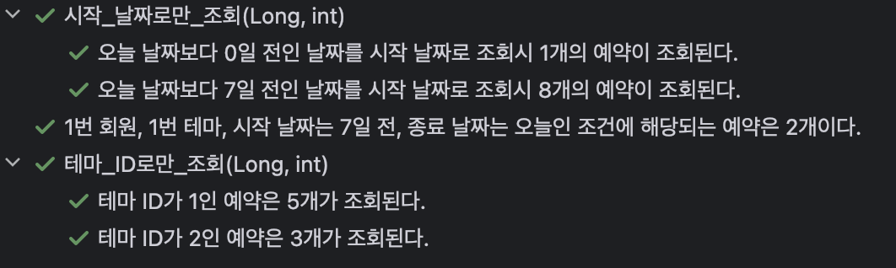
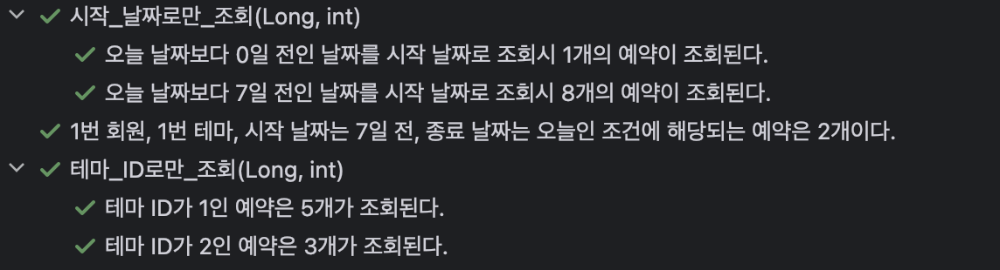

## 목표

이번 글에서는, 지난 편에서 알아본 Specification을 이용해 `특정 회원 / 특정 테마 / 시작 날짜 / 종료 날짜` 로 예약을 조회하는 동적 쿼리를 만들어 보겠습니다.😄

## 기본 코드

### Entity

이전 1편에 작성된 내용이지만, 다시 한번 작성하겠습니다.

```java
@Entity
@NoArgsConstructor(access = AccessLevel.PROTECTED)
@Getter
public class Reservation {

    @Id
    @GeneratedValue(strategy = GenerationType.IDENTITY)
    private Long id;
    private LocalDate date;
    @ManyToOne
    private Member member;
    @ManyToOne
    private Theme theme;
    @ManyToOne
    private ReservationTime reservationTime;
		
		..
}
```

Member, Theme, ReservationTIme는 다음과 같이 구성되어 있습니다.

- Member: `ID` 및 `회원 이름`에 해당되는 `String name` 을 필드로 가집니다.
- Theme: ID 및 `테마 이름`에 해당되는 `String name` 을 필드로 가집니다.
- ReservationTime: ID 및 `시작 시간`에 해당되는 `LocalTime startAt` 을 필드로 가집니다.

### API

`GET /admin/reservations/filter` 를 통해 호출하며, 쿼리 파라미터를 이용합니다. 파라미터의 구성은 다음과 같습니다. 값을 선택하지 않는 경우는 전체를 조회합니다.

- 회원(memberId): 선택한 회원의 ID(PK)값.
- 테마(themeId): 회원과 동일합니다.
- 시작 날짜(startDate):  선택한 날짜도 범위에 포함하며, `yyyy-MM-dd` 형식입니다.
- 종료 날짜(endDate): 시작 날짜와 동일합니다.

Endpoint 설정은 JavaScript를 통해 하고 있고, 크게 의미가 없지만 변환 코드를 대략적으로 보면 다음과 같습니다.

(자바스크립트는 제가 전혀 몰라.. 구글링과 인텔리제이 자동완성으로 이리저리 찍어서 구현했습니다)

```jsx
if (themeId !== "") queryParams.themeId = themeId;
if (memberId !== "") queryParams.memberId = memberId;
if (startDate !== "") queryParams.startDate = startDate;
if (endDate !== "") queryParams.endDate = endDate;

const searchParams = new URLSearchParams(queryParams);
const endpoint = '/admin/reservations';
const url = searchParams.toString().length > 0 ? `${endpoint}/filter?${searchParams.toString()}` : endpoint;
```

따라서, 아무 값도 선택하지 않으면 기존에 있는 모든 예약을 조회하는 `GET /admin/reservations` 를 호출합니다.

```jsx
// 아무 것도 선택하지 않은 경우
/admin/reservations

// ID가 1인 테마만 선택한 경우
/admin/reservations/filter?themeId=1

// ID가 1인 테마와, 시작 날짜를 2024년 6월 27일로 지정하는 경우
/admin/reservations/filter?themeId=1&startDate=2024-06-27
```

### 응답 DTO

```jsx
public record ReservationResponse(
        Long id,
        LocalDate date,
        LocalTime startAt,
        String memberName,
        String themeName
) {
    public static ReservationResponse from(Reservation reservation) {
        return new ReservationResponse(
                reservation.getId(),
                reservation.getDate(),
                reservation.getTime().getStartAt(),
                reservation.getMember().getName(),
                reservation.getTheme().getName()
        );
    }
}
```

예약을 조회할 땐 `예약 ID(PK) /  날짜 / 시작 시간 / 회원 이름 / 테마 이름` 을 가진 DTO를 사용합니다.

### 컨트롤러

```java
@RestController
@RequiredArgsConstructor
public class ReservationController {

    private final ReservationRepository reservationRepository;

    @GetMapping("/admin/reservations")
    public List<ReservationResponse> findAllReservations() {
        return reservationRepository.findAll().stream()
                .map(ReservationResponse::from)
                .toList();
    }

    @GetMapping("/admin/reservations/filter")
    public List<ReservationResponse> findAllReservationsBy(
            @RequestParam(required = false) Long memberId,
            @RequestParam(required = false) Long themeId,
            @RequestParam(required = false) LocalDate startDate,
            @RequestParam(required = false) LocalDate endDate
    ) {
		    ..
        return null;
    }
}
```

조회를 하는 것이 목적이므로, Service는 생략하고 바로 Repository를 이용하도록 구현하였습니다. 이번 목표는 `findAllReservationBy()` 를 완성하는 것입니다😄

### 테스트용 데이터

테스트용 데이터는 이전 1편에서와 동일한 데이터를 사용하겠습니다. 전체 코드를 복붙하긴 좀 길어서, 다음과 같이 요약하겠습니다. 파일명은 `spec_test_data.sql` 입니다.

1. 회원은 ID가 1이고 이름이 ‘1번 회원’인 회원과 ID가 2이고 이름이 ‘2번 회원’ 두 명으로 구성
2. 테마 역시 이름이 ‘1번 테마’, ‘2번 테마’인 두 개로 구성.
3. 예약은 총 8개가 존재합니다.
    - 날짜는 모두 오늘을 기준으로 하며, 시간은 15시로 통일
    - 1번 회원의 예약:  `오늘(1번 테마) / 1일 전(2번 테마) / 2일 전(1번 테마) / 3일 전(2번 테마)`
    - 2번 회원의 예약: `4일 전(1번 테마) / 5일 전(2번 테마) / 6일 전(1번 테마) / 7일 전(1번 테마)`
    - 1번 회원의 예약은 4개, 2번 회원의 예약도 4개
    - 1번 테마의 예약은 5개, 2번 테마의 예약은 3개 입니다.

## 들어가기 전에..

본격적인 구현을 하기 전에, 지난 편에서 **Specification이 null인 경우 모든 데이터를 조회**한다는 것을 확인할 수 있었고,아래의 Specification 소스코드를 보면 입력된 Specification이 null인 경우 null을 반환하고 있네요.

```java

public interface Specification<T> extends Serializable {
		..

    static <T> Specification<T> not(@Nullable Specification<T> spec) {
        return spec == null ? (root, query, builder) -> {
            return null;
        } : (root, query, builder) -> {
            return builder.not(spec.toPredicate(root, query, builder));
        };
    }
    
    ..
}
```

예를 들어 **테마가 입력되지 않으면 모든 테마를 조회**해야 하므로, 컨트롤러 메서드를 보면 `@RequestParam(required = false)` 로 지정되어 있습니다. `required = false` 는 해당 **파라미터가 없는 경우 null로 대체**하므로, 다음과 같이 입력된 값이 null인 경우 null을 반환하는 조건식을 추가하여 구현해야 합니다.

```java
public static Specification<Reservation> method(Object param)  {
	if (param == null) {
		return null;
	} ..
}
```

이제 본격적으로 구현해 보겠습니다.

## 첫 번째 방법

[공식 문서](https://docs.spring.io/spring-data/jpa/reference/jpa/specifications.html)에 있는 방법과 동일하게 구현해 보겠습니다.

```java
public class ReservationFilterSpecs {

    public static Specification<Reservation> hasMemberId(Long memberId) {
        if (memberId == null) {
            return null;
        }
        return (root, query, criteriaBuilder) -> criteriaBuilder.equal(root.get("member").get("id"), memberId);
    }

    public static Specification<Reservation> hasThemeId(Long themeId) {
        if (themeId == null) {
            return null;
        }
        return (root, query, criteriaBuilder) -> criteriaBuilder.equal(root.get("theme").get("id"), themeId);
    }

    public static Specification<Reservation> dateStartFrom(LocalDate date) {
        if (date == null) {
            return null;
        }
        return (root, query, criteriaBuilder) -> criteriaBuilder.greaterThanOrEqualTo(root.get("date"), date);
    }

    public static Specification<Reservation> dateEndAt(LocalDate date) {
        if (date == null) {
            return null;
        }
        return (root, query, criteriaBuilder) -> criteriaBuilder.lessThanOrEqualTo(root.get("date"), date);
    }
}
```

테마와 회원을 이용한 조회는 이전 편에서 사용했던 `equal()` 을 이용했고, 시작 날짜와 종료 날짜는 입력된 날짜도 포함하도록 `greaterThanOrEqualTo` 등을 사용했습니다. 만약 포함하지 않으려면 `greaterThan(lessThan)` 을 사용하면 됩니다!

이제 컨트롤러 메서드는 다음과 같이 구현할 수 있습니다.

```java
@GetMapping("/admin/reservations/filter")
public List<ReservationResponse> findAllReservationsBy(
        @RequestParam(required = false) Long memberId,
        @RequestParam(required = false) Long themeId,
        @RequestParam(required = false) LocalDate startDate,
        @RequestParam(required = false) LocalDate endDate
) {
	  Specification<Reservation> specs = ReservationFilterSpecs.hasMemberId(memberId)
	      .and(ReservationFilterSpecs.hasThemeId(themeId))
	      .and(ReservationFilterSpecs.dateStartFrom(startDate))
	      .and(ReservationFilterSpecs.dateEndAt(endDate));
	
		return reservationRepository.findAll(specs).stream()
		        .map(ReservationResponse::from)
		        .toList();
~~}~~
```

### (참고) 조금 다른 방법

지금 보면 모든 Specification이 `and` 연산으로 연결되고 있는데요, Specification에는 다음과 같이 **모든 연산을 and로 연결**하는 `allOf()` 메서드가 존재합니다.

```java
static <T> Specification<T> allOf(Iterable<Specification<T>> specifications) {
    return (Specification)StreamSupport.stream(specifications.spliterator(), false).reduce(where((Specification)null), Specification::and);
}

@SafeVarargs
static <T> Specification<T> allOf(Specification<T>... specifications) {
    return allOf((Iterable)Arrays.asList(specifications));
}
```

이 방법으로 이전과 동일한 Specification 객체를 얻을 수 있습니다. `모든 조건을 or로 묶고 싶을때는 anyOf()`를 사용하면 됩니다.

```java
Specification<Reservation> specs = Specification.allOf(
		ReservationFilterSpecs.hasMemberId(memberId),
		ReservationFilterSpecs.hasThemeId(themeId),
		ReservationFilterSpecs.dateStartFrom(startDate),
		ReservationFilterSpecs.dateEndAt(endDate)
);		
```

### 테스트

그러면, 테스트용 데이터를 이용해 직접 테스트 해보겠습니다. 이번에는 지난 편에서 한 것처럼 repository로 테스트하는 것이 아니라, RestAssured를 이용해 API를 직접 호출하는 방식으로 확인하겠습니다😄 

**테마 ID만을 이용하여 조회**

```java
@ParameterizedTest(name = "테마 ID가 {0}인 예약은 {1}개가 조회된다.")
@CsvSource(value = {"1/5", "2/3"}, delimiter = '/')
@Sql({"/truncate.sql", "/spec_test_data.sql"})
void 테마_ID로만_조회(Long themeId, int expectedCount) {
    List<ReservationResponse> result = RestAssured.given().log().all()
            .queryParam("themeId", themeId)
            .when().get("/admin/reservations/filter")
            .then().log().all()
            .statusCode(200)
            .body("size()", is(expectedCount))
            .extract().response().jsonPath().getList("", ReservationResponse.class);

    assertThat(result).extracting("themeName").containsOnly(themeId + "번 테마");
}
```

우선 RestAssured를 이용해 조회된 예약의 개수를 검증하고, 조회된 예약이 모두 해당 테마에 대한 예약인지 확인합니다. 회원 ID로 조회하는 테스트는 위 테스트와 거의 같아서 생략하겠습니다.

**시작 날짜만을 이용하여 조회**

```java
@ParameterizedTest(name = "오늘 날짜보다 {0}일 전인 날짜를 시작 날짜로 조회시 {1}개의 예약이 조회된다.")
@CsvSource(value = {"0/1", "7/8"}, delimiter = '/')
@Sql({"/truncate.sql", "/spec_test_data.sql"})
void 시작_날짜로만_조회(Long days, int expectedCount) {
    LocalDate startDate = LocalDate.now().minusDays(days);

    List<ReservationResponse> result = RestAssured.given().log().all()
            .queryParam("startDate", startDate.toString())
            .when().get("/admin/reservations/filter")
            .then().log().all()
            .statusCode(200)
            .body("size()", is(expectedCount))
            .extract().response().jsonPath().getList("", ReservationResponse.class);

    assertThat(result).extracting("date").allMatch(date -> {
        LocalDate value = (LocalDate) date;
        return value.isEqual(startDate) || value.isAfter(startDate);
    });
}
```

시작 날짜가 오늘인 예약과 7일 전인 예약으로 테스트합니다. 이전과 같이 조회된 예약의 개수를 확인하고, 조회된 예약이 모두 입력된 시작 날짜와 같거나 그 이후인지 확인합니다. 종료 날짜로 조회하는 테스트는 위 테스트와 거의 같아서 생략하겠습니다.

**모든 값을 다 넣고 조회**

```java
@Test
@DisplayName("1번 회원, 1번 테마, 시작 날짜는 7일 전, 종료 날짜는 오늘인 조건에 해당되는 예약은 2개이다.")
@Sql({"/truncate.sql", "/spec_test_data.sql"})
void 모든_조건으로_조회() {
    Long memberId = 1L;
    Long themeId = 1L;
    LocalDate startDate = LocalDate.now().minusDays(7);
    LocalDate endDate = LocalDate.now();

    List<ReservationResponse> result = RestAssured.given().log().all()
            .queryParam("memberId", memberId)
            .queryParam("themeId", themeId)
            .queryParam("startDate", startDate.toString())
            .queryParam("endDate", endDate.toString())
            .when().get("/admin/reservations/filter")
            .then().log().all()
            .statusCode(200)
            .body("size()", is(2))
            .extract().response().jsonPath().getList("", ReservationResponse.class);

    assertThat(result).extracting("memberName").containsOnly("1번 회원");
    assertThat(result).extracting("themeName").containsOnly("1번 테마");
    assertThat(result).extracting("date").allMatch(date -> {
        LocalDate value = (LocalDate) date;
        return value.isEqual(startDate) || value.isEqual(endDate) || (value.isAfter(startDate) || value.isBefore(endDate));
    });
}
```

회원, 테마, 시작일, 종료일을 모두 넣고 확인합니다. 방식은 이전과 같습니다.



테스트는 모두 정상적으로 통과합니다.

## 두 번째 방법

> Specification 구현과 활용은 좋습니다 👍
>
>
> 다만 ReservationSpecification의 역할이 유틸객체인 것이 어색하게 느껴집니다. ReservationSpecificationHelper 정도로 객체명을 갈음하거나, 아니면 내부에서 조합하여 ReservationSpecification 자체를 활용할 수 있도록 해주는 것도 좋겠습니다.
>

첫 번째 방법으로도 기능 구현 자체는 완료되었지만, 코드 리뷰를 받는 도중 리뷰어께서 위와 같은 의견을 주셨습니다.

(본문에 사용하는 코드는 처음부터 새로 작성하였기에 ReservationFilterSpecs이고, 이전에 제출은 ReservationSpecification으로 했었습니다 😅)

리뷰어께서 주신 의견도 그렇고, 제가 구현하면서 찝찝했던 부분도 있었습니다. 이전 코드를 일부 불러오겠습니다.

```java
Specification<Reservation> specs = ReservationFilterSpecs.hasMemberId(memberId)
	      .and(ReservationFilterSpecs.hasThemeId(themeId))
	      .and(ReservationFilterSpecs.dateStartFrom(startDate))
	      .and(ReservationFilterSpecs.dateEndAt(endDate));
```

그대로 사용해도 크게 문제는 없지만.. ReservationFilterSpecs가 반복되는 것이 그나마 아쉬웠고, 리뷰어께서 주신 의견 중 클래스명 수정은 너무 간단하기에, 객체 내부에서 조합할 수 있도록 구현해 보겠습니다. 구현은 Builder를 이용하겠습니다.

```java
public class ReservationFilterSpecs {

	public static Builder builder() {
		return new Builder();
	}
	
	public static class Builder {
		
		private Specification<Reservation> spec;
		..
	}
}
```

우선, 내부에서 조립하려면 Specification 필드가 하나 있어야겠네요. 이 필드는 새로운 조건이 추가될 때 마다 수정되어야 하므로 final이 아닌 변수로 지정했습니다. 그러면 다음의 문제는 이 spec 변수를 초기화하는 것이네요.

```java
static <T> Specification<T> where(@Nullable Specification<T> spec) {
    return spec == null ? (root, query, builder) -> {
        return null;
    } : spec;
}
```

이 코드는 Specification 소스 코드에 있는 `where()` 메서드인데, `입력된 spec이 null이면 null`을 , `null이 아니면 그대로 반환`합니다. 따라서 이 메서드에 null을 넣으면 null인 Specification이 반환될 것이라 기대할 수 있겠습니다.

```java
public class ReservationFilterSpecs {
	..
	public static class Builder {
		
		private Specification<Reservation> spec;
		
		public Builder() {
			this.spec = Specification.where(null);
		}
	}	
}
```

따라서 위와 같이 필드의 초기화를 할 수 있겠네요! 다음으로는 조건식을 하나씩 추가해 보겠습니다.

지금의 요구사항에서는 and 조건만 사용하기에, 입력된 값이 null이 아니면 and 조건을 더한 Specification으로 필드를 업데이트 하면 되겠네요.

```java
public Builder hasMemberId(Long memberId) {
    if (memberId != null) {
        this.spec = this.spec.and((root, query, criteriaBuilder) -> criteriaBuilder.equal(root.get("member").get("id"), memberId));
    }
    return this;
}
```

입력된 값이 null이 아니면 필드를 업데이트 하고, null이면 필드를 그대로 유지한 채 자기 자신을 반환하도록 했습니다. 나머지 조건식도 마저 만들어 보겠습니다.

```java
public Builder hasThemeId(Long themeId) {
    if (themeId != null) {
        this.spec = this.spec.and((root, query, criteriaBuilder) -> criteriaBuilder.equal(root.get("theme").get("id"), themeId));
    }
    return this;
}

public Builder dateStartFrom(LocalDate dateFrom) {
    if (dateFrom != null) {
        this.spec = this.spec.and((root, query, criteriaBuilder) -> criteriaBuilder.greaterThanOrEqualTo(root.get("date"), dateFrom));
    }
    return this;
}

public Builder dateEndAt(LocalDate dateTo) {
    if (dateTo != null) {
        this.spec = this.spec.and((root, query, criteriaBuilder) -> criteriaBuilder.lessThanOrEqualTo(root.get("date"), dateTo));
    }
    return this;
}
```

이렇게 하면, 마지막으로 필드인 Specification 객체를 반환하는 메서드만 만드면 되겠네요!

```java
public Specification<Reservation> build() {
    return this.spec;
}
```

새롭게 정의한 방법으로, 다시 컨트롤러 메서드를 수정해 보겠습니다. 나머지 부분은 동일하므로 Specification 객체 선언 부분만 작성하겠습니다.

```java
// 수정 전
Specification<Reservation> specs = ReservationFilterSpecs.hasMemberId(memberId)
			  .and(ReservationFilterSpecs.hasThemeId(themeId))
			  .and(ReservationFilterSpecs.dateStartFrom(startDate))
			  .and(ReservationFilterSpecs.dateEndAt(endDate));
    
// 수정 후
Specification<Reservation> specs = ReservationFilterSpecs.builder()
        .hasMemberId(memberId)
        .hasThemeId(themeId)
        .dateStartFrom(startDate)
        .dateEndAt(endDate)
        .build();
```

다른 부분은 크게 체감하기 힘들지만, 중복이 제거되니 훨씬 더 직관적으로 보이는 것은 체감할 수 있네요. 마지막으로 변경된 코드로 이전과 동일한 테스트를 돌려보겠습니다.



정상적으로 통과합니다😄

## 결론: 그래서 어떤 방법이 좋을까?🧐

두 번째 방법이 객체 자체를 활용하고 조금 더 직관적이라는 장점이 있지만, 사실 `and` 연산에 한정된다는 단점 역시 존재합니다.

예를 들어 **테마가 1번이거나 2번인 모든 예약을 조회**한다고 할 때, 첫 번째 방법으로 구현했다면 다음과 같이 쉽게 얻어낼 수 있습니다. 하지만 두 번째 방법으로는 구현할 수 없습니다.

```java
Specification<Reservation> specs = ReservationFilterSpecs.hasMemberId(memberId)
    .or(ReservationFilterSpecs.hasThemeId(themeId));
```

지금 요구사항에서는 and만 사용하고 있기에 크게 문제가 없으나 `or 및 기타 연산`을 사용해야 한다면 사용하기 힘든 방법이기도 합니다. 지금은 학습 단계이기에 내부에서 조립하는 방법을 시도해본 것이지만, **확장성을 고려하면 공식 문서에 나온 것 처럼 static 메서드로 구성하는 첫 번째 방법이 더 좋은 것 같습니다**.

글이 이렇게 길어질 줄 몰랐는데.. 필요하다고 느껴지는 것을 넣다보니 정말 길어졌네요. 읽어주셔서 감사드리고, 즐거운 하루 보내세요🙇


```toc
```