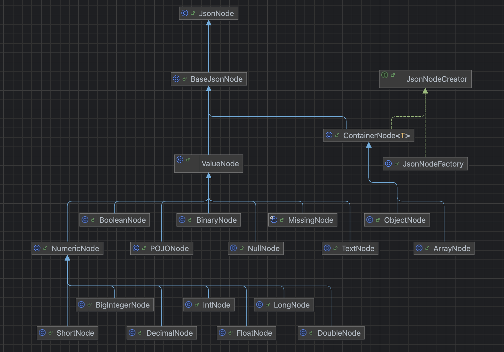

## 이전 편 내용 요약

1. `@Valid` 어노테이션의 검증을 통해 발생하는 예외는 `MethodArgumentNotValidException` 입니다.
2. 테마, 시간 추가의 경우 값을 입력하지 않으면 빈 문자열(`””`)으로 JSON에 담겼기에 `@NotBlank` 를 통해 `MethodArgumentNotValidException` 이 발생했습니다.
3. 예약을 추가할 때는 회원, 날짜, 테마, 시간을 입력받습니다.
4. 날짜의 경우 입력하지 않으면 빈 문자열로 요청 JSON에 담기기에(`”date”: “”`) MethodArgumentNotValidException이 발생합니다.
5. 회원, 테마, 시간은 입력하지 않으면 각각 빈 문자열이 아닌 `“멤버 입력”, “테마 입력”, “시간 입력”` 으로 값이 담기고, 이 값을 Long 타입으로 파싱할 수 없습니다.
    - 따라서 역직렬화 과정에서 InvalidFormatException이 발생하고, Jackson은 이 예외를 HttpMessageNotReadableException으로 던집니다.

**결론: 하나의 요청에서 다른 타입의 예외들이 발생하는데 이 예외를 한 번에 처리할 수가 없었습니다.**

<br/>

## Custom Deserializer 시작

지금 현재의 문제를 크게 보면 **역직렬화** 과정에서 발생하는 문제이고, 이 문제를 해결하기 위해 Deserializer를 키워드로 구글링을 하던 도중, [Baeldung의 글](https://www.baeldung.com/jackson-deserialization)을 찾게 되었습니다.

> 여담: 이번 레벨에서는 공식문서 다음으로 Baeldung을 가장 많이 참고하는 것 같습니다 ㅎㅎ
>

우선, 지난 글에 작성했지만 역직렬화가 필요한 요청 DTO 코드를 다시 한번 작성하겠습니다.

```java
public record AdminReservationCreateRequest(
        @NotNull(message = "날짜를 입력해 주세요.") LocalDate date,
        @NotNull(message = "시간을 입력해 주세요.") Long timeId,
        @NotNull(message = "테마를 입력해 주세요.") Long themeId,
        @NotNull(message = "회원을 입력해 주세요.") Long memberId
) {
}
```

Postman을 이용하여 확인해보니, **@NotNull** 어노테이션은 **JSON에 해당 필드 자체가 없는 상황**에서 예외를 던지고 있었습니다. 하지만 페이지에서 직접 예약을 추가할 땐, 필드 자체가 없는 상황이 없으므로.. 지금 상황에서는 크게 의미가 있진 않았습니다.

<br/>

```java
public class AdminReservationCreateRequestDeserializer extends StdDeserailizer<AdminReservationCreateRequest> {

	// 생성자는 Baeldung에 있는 것과 동일하게 작성
	
	@Override
	public AdminReservationCreateRequest deserialize(JsonParser jsonParser, DeserializationContext deserializationContext)
            throws IOException, JacksonException {
            
     JsonNode jsonNode = jsonParser.getCodec().readTree(jsonParser);
     ..
  }
}
```

코드를 보니, 일단 JsonNode라는 객체를 먼저 꺼내옵니다. 어찌됐든 이 객체를 활용하는 것이기에, `getCodec().readTree()`  부분은 그냥 이렇게 불러오는구나 ~ 하고 넘어갔습니다. 자연스레 다음 의문은 JsonNode가 무엇인지로 이어집니다.

사실 이번 문제는 getter를 그냥 느낌대로 쓰다보니 어느정도 해결이 되었는데요, Custom Deserializer는 추후에도 충분히 사용할 수 있다고 생각되어 이번 기회에 JsonNode도 이해하면 좋겠다고 생각했습니다.

<br/>

## JsonNode가 뭔가요?

### 공식 문서

[공식 문서](https://www.javadoc.io/doc/com.fasterxml.jackson.core/jackson-databind/2.8.5/com/fasterxml/jackson/databind/JsonNode.html)를 보면, 다음과 같이 적혀있습니다.

> Base class for all JSON nodes, which form the basis of JSON Tree Model that Jackson implements. One way to think of these nodes is to consider them similar to DOM nodes in XML DOM trees.
>
>
> As a general design rule, most accessors ("getters") are included in this base class, to allow for traversing structure without type casts. Most mutators, however, need to be accessed through specific sub-classes (such as `ObjectNode` and `ArrayNode`). This seems sensible because proper type information is generally available when building or modifying trees, but less often when reading a tree (newly built from parsed JSON content).
>
> Actual concrete sub-classes can be found from package [`com.fasterxml.jackson.databind.node`](https://www.javadoc.io/static/com.fasterxml.jackson.core/jackson-databind/2.8.5/com/fasterxml/jackson/databind/node/package-summary.html).
>
> Note that it is possible to "read" from nodes, using method [`TreeNode.traverse(ObjectCodec)`](https://fasterxml.github.com/jackson-core/javadoc/2.7/com/fasterxml/jackson/core/TreeNode.html?is-external=true#traverse(com.fasterxml.jackson.core.ObjectCodec)), which will result in a [`JsonParser`](https://fasterxml.github.com/jackson-core/javadoc/2.7/com/fasterxml/jackson/core/JsonParser.html?is-external=true) being constructed. This can be used for (relatively) efficient conversations between different representations; and it is what core databind uses for methods like [`ObjectMapper.treeToValue(TreeNode, Class)`](https://www.javadoc.io/static/com.fasterxml.jackson.core/jackson-databind/2.8.5/com/fasterxml/jackson/databind/ObjectMapper.html#treeToValue(com.fasterxml.jackson.core.TreeNode,%20java.lang.Class)) and [`ObjectMapper.treeAsTokens(TreeNode)`](https://www.javadoc.io/static/com.fasterxml.jackson.core/jackson-databind/2.8.5/com/fasterxml/jackson/databind/ObjectMapper.html#treeAsTokens(com.fasterxml.jackson.core.TreeNode))
>

사실 처음 읽었을 땐, **음.. 그렇구나..** 라는 생각만 들더라구요. 이 문서에선 그냥 `JSON 값들을 트리 형태로 구성하는 거구나. getter를 통해 값을 꺼낼 수 있구나` 정도만 일단 파악하는게 합리적이라고 생각했습니다.

<br/>

### JsonNode 구성

```java
package com.fasterxml.jackson.databind;

public abstract class JsonNode extends JsonSerializable.Base implements TreeNode, Iterable<JsonNode> {
	...
}
```

소스코드를 확인해보니, 우선 기본적으로 JsonNode는 `TreeNode` 인터페이스를 구현하고 있고, 그 아래에 JsonNode를 상속받는 클래스들이 존재했습니다. 상속받는 클래스들은 `com.fasterxml.jackson.databind.node` 패키지에 존재했는데요, **Intellij의 다이어그램 기능**을 활용해 보겠습니다.

<br/>



이 다이어그램을 보고, 저는 아래의 세 가지를 생각(추측)할 수 있었습니다.

1. JsonNode는 ValueNode와 ContainerNode로 구분할 수 있다.
2. ValueNode 하위의 노드들과 ContainerNode 하위의 노드들을 보니, ValueNode는 값을 저장하는 노드이고 ContainerNode는 Json 자체 혹은 하위의 배열을 저장하는 노드일 것이라고 추측할 수 있다.
3. 그러면, `JsonNode jsonNode = jsonParser.getCodec().readTree(jsonParser);` 를 이용하여 꺼낸 노드는 **ContainerNode**일 것이고, 여기서 getter를 사용하면 ValueNode를 얻어낼 수 있을 것 같다.

이 추측을 바탕으로 실제로 확인 해 보기 전에, JsonNode의 소스 코드를 보며 Type에 대해 조금 더 알아보겠습니다.

<br/>

### JsonNode의 타입

```java
public enum JsonNodeType {
    ARRAY,
    BINARY,
    BOOLEAN,
    MISSING,
    NULL,
    NUMBER,
    OBJECT,
    POJO,
    STRING;

    private JsonNodeType() {
    }
}
```
JsonNode는, 위의 Enum을 통해 타입을 분류하고 있습니다. 이름만으로도 어느정도 유추가 가능하네요. 

<br/>


```java
public final boolean isValueNode() {
    switch (this.getNodeType()) {
        case ARRAY:
        case OBJECT:
        case MISSING:
            return false;
        default:
            return true;
    }
}

public final boolean isContainerNode() {
    JsonNodeType type = this.getNodeType();
    return type == JsonNodeType.OBJECT || type == JsonNodeType.ARRAY;
}

public abstract JsonNodeType getNodeType();
```

위의 `JsonNodeType` enum과 이 JsonNode의 코드를 보면, 타입은 다음과 같이 구분할 수 있겠네요.
1. `ARRAY, OBJECT`는 `ContainerNode`이다.
2. `MISSING`은 `ValueNode도, ContainerNode도 아니다.`
3. `나머지는 ValueNode`이다.


<br/>

### get() vs path()와 MissingNode

실제로 노드를 꺼내서 확인해보기 전에, `get()`과 `path()`, 그리고 `MissingNode`에 대해 한번 더 언급하고 가겠습니다. 

```java
JsonNode rootNode = jsonParser.getCodec().readTree(jsonParser);

JsonNode jsonNode1 = rootNode.get("jsonNode");
JsonNode jsonNode2 = rootNode.path("jsonNode");
```

**(미리 스포하자면 rootNode는 JsonNode를 상속받는 ObjectNode 타입입니다.)** 위 코드만 보면, get과 path는 크게 달라보이지 않습니다. 그러면 어떤 것을 사용해야 할까요?

<br/>

JsonNode를 상속받는 ObjectNode의 소스코드를 확인해 보겠습니다.

```java
public class ObjectNode extends ContainerNode<ObjectNode> implements Serializable {

	protected final Map<String, JsonNode> _children;
	..
	
	public JsonNode get(String propertyName) {
		return (JsonNode) this._children.get(propertyName);
	}
	
	..
	
	public JsonNode path(String propertyName) {
    JsonNode n = (JsonNode)this._children.get(propertyName);
    return (JsonNode)(n != null ? n : MissingNode.getInstance());
  }
}
```

이 코드를 보면, **get은 Json에 필드가 없으면 null을, path는 MissingNode 타입 객체를 반환**하는 것을 알 수 있습니다. **저는 앞으로 NPE 방지를 위해 path()를 사용하겠습니다!**

<br/>

### 🚀 타입을 직접 확인해 보겠습니다.

우선, 다음과 같은 JSON과 여기에 대응되는 DTO 객체를 만들어 보겠습니다.

```json
{
  "number": 1,
  "string": "text",
  "null": null,
  "boolean": true,
  "objectList" : {
      "obj1": 1,
      "obj2": "text"
  }
}
```


```java
@JsonDeserialize(using = JsonTestRequestDeserializer.class)
public record JsonTestRequest(Long number, String string, Object nullObject, Boolean booleanObject,
                              List<Object> objectList) {
}
```

(미리 스포할 수 밖에 없네요 ㅠㅠ) 마지막에 다룰 Custom Deserializer는 해당되는 객체에 `@JsonDeserialize`를 붙여 적용할 수 있습니다 ㅎㅎ

<br/>

마지막으로, Custom Deserializer를 대략적으로 만들어 보겠습니다! (메서드만 작성하겠습니다)

```java
@Override
public JsonTestRequest deserialize(JsonParser jsonParser, DeserializationContext deserializationContext)
        throws IOException, JacksonException {

    JsonNode rootNode = jsonParser.getCodec().readTree(jsonParser);

    JsonNode numberNode = rootNode.path("number");
    JsonNode stringNode = rootNode.path("string");
    JsonNode nullNode = rootNode.path("null");
    JsonNode booleanNode = rootNode.path("boolean");
    JsonNode objectListNode = rootNode.path("objectList");
    JsonNode missingNode = rootNode.path("missing");

    System.out.println("rootNode.getNodeType() = " + rootNode.getNodeType());
    System.out.println("numberNode.getNodeType() = " + numberNode.getNodeType());
    System.out.println("stringNode.getNodeType() = " + stringNode.getNodeType());
    System.out.println("nullNode.getNodeType() = " + nullNode.getNodeType());
    System.out.println("booleanNode.getNodeType() = " + booleanNode.getNodeType());
    System.out.println("objectListNode.getNodeType() = " + objectListNode.getNodeType());
    System.out.println("missingNode.getNodeType() = " + missingNode.getNodeType());

    return new JsonTestRequest(
            rootNode.get("number").asLong(),
            rootNode.get("string").asText(),
            rootNode.get("null"),
            rootNode.get("boolean").asBoolean(),
            Arrays.asList(objectListNode.get("obj1").asLong(), objectListNode.get("obj2").asText())
    );
}
```

이전 문단에서 언급했던 것 처럼, `MissingNode`를 체크하기 위해 get()이 아닌 `path()`를 사용했고 이렇게 얻어낸 노드들의 타입을 출력한 뒤 DTO로 매핑하고 있습니다. `asLong(), asText()` 와 같은 것은 이후에 작성하겠습니다.

<br/>

실제로 코드를 실행해보면 다음과 같은 결과가 나오구요,
```java
rootNode.getNodeType() = OBJECT
numberNode.getNodeType() = NUMBER
stringNode.getNodeType() = STRING
nullNode.getNodeType() = NULL
booleanNode.getNodeType() = BOOLEAN
objectListNode.getNodeType() = OBJECT
missingNode.getNodeType() = MISSING
```

출력 결과를 정리해보면

1. 전체 JSON인 rootNode와, JSON 내부의 배열인 objectListNode는 ObjectNode가 됩니다.
    - **이 노드들은 내부에 여러 값을 가지고 있기에, ContainerNode에 해당됩니다.**
2. 나머지 노드들은, 각각 **값을 가지고 있는 ValueNode**에 속합니다.
3. 위의 Json에 `“missing”` 필드는 없기 때문에, missingNode는 MissingNode 타입이 됩니다.

```java
JsonTestRequest[number=1, string=text, nullObject=null, booleanObject=true, objectList=[1, "text"]]
```

마지막으로, 만들어진 `JsonTestRequset`  객체를 출력해보면, 값이 잘 들어간 것을 확인할 수 있습니다 ㅎㅎ

<br/>


## JsonNode에서 값 꺼내기

JsonNode에서 get(), path() 등을 하다 보면, 값을 가지고 있는 ValueNode를 얻어낼 수 있습니다.

> 만약 ContainerNode라면 get(), path()를 또 적용해서 ValueNode를 얻어내야 합니다 ㅎㅎ
>

그러면, ValueNode에서의 값은 어떻게 꺼낼 수 있을까요? 값은 `숫자, 불리언, 문자열 타입`으로 가져올 수 있습니다. 기본값을 지정할 수도 있지만, **이번에는 기본값을 지정하지 않는 경우를 위주로 확인** 하겠습니다.

### 1. 숫자 값 꺼내기

종류로는 `asLong(), asInt(), asDouble()`이 있고, 예시에서는 Long을 기준으로 작성하겠습니다.

우선, JsonNode에 있는 `asLong()` 메서드를 먼저 확인해 보겠습니다.

```java
public long asLong() {
    return this.asLong(0L);
}

public long asLong(long defaultValue) {
    return defaultValue;
}
```

코드를 보니, `asLong()`을 호출하면 기본값을 0으로 지정하고 `asLong(long defaultValue)`을 호출하는데, 이 메서드는 하위 클래스에서 Override 하고 있습니다. 하위 클래스 중 `NumericNode` 는 값을 그대로 반환하기에, `BooleanNode`와 `TextNode` 만 예시로 작성하겠습니다.

```java
public class BooleanNode extends ValueNode {

	private final boolean _value;
	
  public long asLong(long defaultValue) {
      return this._value ? 1L : 0L;
  }	
}
```

BooleanNode에서는 값이 `true`이면 1을, `false` 이면 0을 반환합니다.

```java
public class TextNode extends ValueNode {

	protected final String _value;
	    
  public long asLong(long defaultValue) {
      return NumberInput.parseAsLong(this._value, defaultValue);
  }
}

public final class NumberInput {

	public static long parseAsLong(String s, long def) {
    if (s == null) {
        return def;
    } else {
	    ..
      try {
          return Long.parseLong(s);
      } catch (NumberFormatException var9) {
          return def;
      }
    ..
  }
}
```

TextNode에선, 값을 Long으로 파싱한 뒤 반환하는데, 이때 사용하는 `NumberInput.parseAsLong` 을 보면, 입력된 값이 null이거나 숫자로 변환할 수 없으면 기본값을 반환합니다. **기본값은 JsonNode에서 0으로 지정했으니, 숫자가 아니거나 null인 경우는 0이 반환되겠네요!**

### 2. 문자열 값 꺼내기

마찬가지로, 우선 JsonNode의 코드를 확인해 보겠습니다.

```java
public abstract String asText();

public String asText(String defaultValue) {
    String str = this.asText();
    return str == null ? defaultValue : str;
}
```

`asText()` 메서드를 이용하여 문자열 값을 꺼내올 수 있고, 이 메서드는 하위 클래스에서 구현하고 있네요. 이전의 숫자 값을 꺼낼때를 생각해보면, 숫자 노드에서는 값을 그대로 꺼내왔고 문자 노드에서는 숫자로 파싱한 뒤 꺼내왔습니다. `그러면 이번에도 문자열 값은 그대로 꺼내고 숫자 값은 문자로 파싱한뒤 꺼낸다.` 정도는 예상할 수 있겠네요 ㅎㅎ

이번에는 소스코드 작성 없이, 결과만 요약하여 정리하겠습니다

| 타입 | 반환값 |
| --- | --- |
| NumericNode | 숫자를 문자열로 변환하여 반환 |
| BooleanNode | true는 “true”, false는 “false”로 반환 |
| MissingNode | “” 즉 빈 문자열 |
| NullNode | “null” |
| TextNode | 값 그대로 반환 |

### 3. 불리언 값 꺼내기

JsonNode에 있는 코드를 먼저 확인해 보겠습니다.

```java
public boolean asBoolean() {
    return this.asBoolean(false);
}

public boolean asBoolean(boolean defaultValue) {
    return defaultValue;
}
```

`asBoolean()` 을 호출하면, `asLong()`과 마찬가지로 기본값으로 false를 넣어 `asBoolean(boolean defaultValue)` 를 호출하고, 이 메서드는 하위 클래스에서 Override 하고 있습니다. 지금까지의 결과를 보면, 혹은 느낌상으로 다음과 같이 예상할 수 있을 것 같네요.

1. TextNode의 경우 `“true” “false”이면 불리언 타입으로 변환하여 반환`한다. 둘다 아니면 기본값인 false를 반환한다.
2. NumericNode의 경우 `0이 아니면 true, 0이면 false`를 반환한다.
3. BooleanNode는 값을 그대로 반환한다.

이렇게 예상했다면, 정답입니다👍👍

## 결론

### 요약

1. JsonNode는 컨테이너 노드와 값 노드로 구성되어 있다. Json 자체와 Json 내부 배열은 컨테이너 노드, 각각의 필드는 값 노드가 된다.
    - 컨테이너 노드는 ObjectNode, ArrayNode를 하위 클래스로 가진다.
    - 값 노드는 Text, Numeric(Long, Int..), Boolean을 하위 클래스로 가진다.
2. `get(String propertyName), path(String propertyName)` 를 이용하여 하위 노드를 꺼낼 수 있다.
3. get은 노드가 존재하지 않으면 null을, path는 MissingNode 객체를 반환하는데 NPE 방지를 위해서 `path()` 를 쓰는 것이 좋을 것 같다.
4. get(), path()를 사용하여 값 노드(ValueNode)를 꺼냈다면, `asLong(), asText(), asBoolean()` 을 이용해 실제 값을 꺼낼 수 있다.

### 다음 편에서 계속됩니다..

JsonNode와 소스코드에 대해 최대한 간단하게 작성했다고 생각했는데, 생각보다 내용이 너무 길어 한번 더 끊고 가야할 것 같네요..😓 다음 편에서는 학습한 JsonNode를 바탕으로 1편의 문제를 Custom Deserializer를 이용하여 해결해 보도록 하겠습니다.

읽어주셔서 감사합니다. 즐거운 하루 보내세요😄

```toc
```