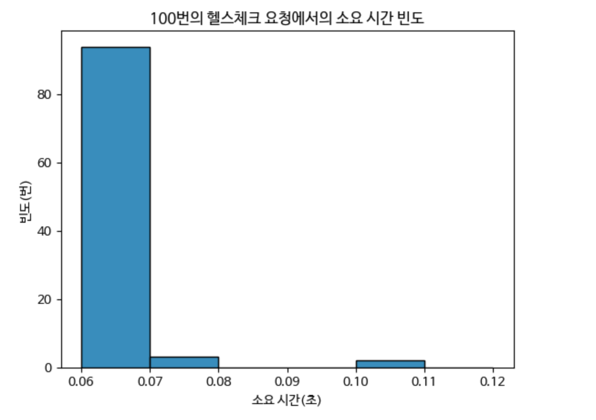
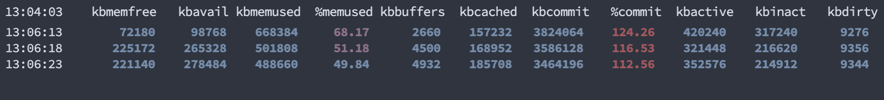
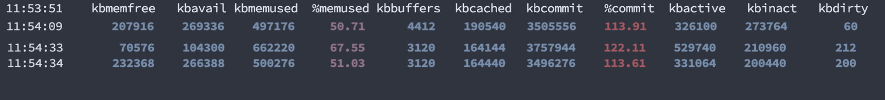
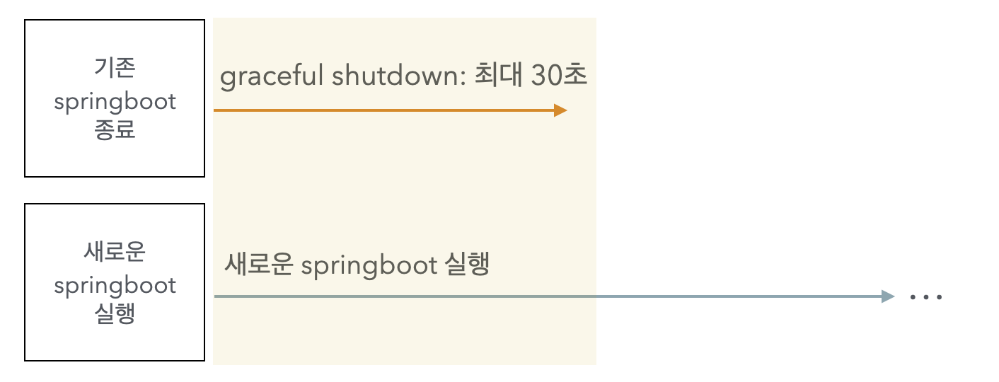
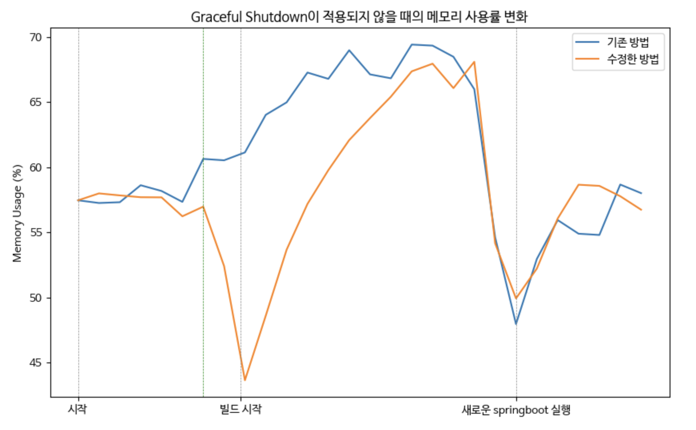
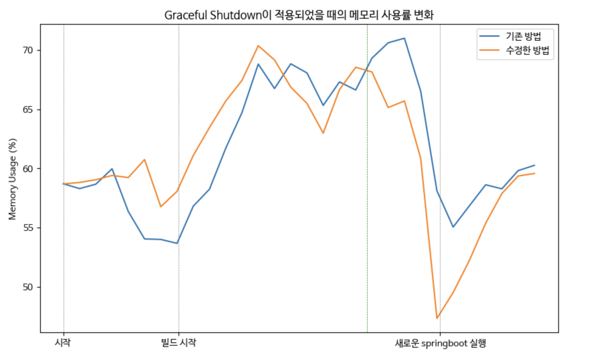

## 배경

프로젝트 팀원인 [테니](https://github.com/ay-eonii)가 기존의 무중단 배포에서 다운타임이 발생하는 문제를 해결하는 [PR](https://github.com/woowacourse-teams/2024-mouda/pull/794)을 올렸습니다.

> 자세한 내용은 해당 PR에서 확인하실 수 있습니다.
>

문제도 잘 파악했고, 해결까지의 전체 과정을 문서화해서 공유해준 덕분에 전체 과정을 빠르게 이해할 수 있었는데요(**테니 감사합니다 😄**), 제가 PR에 남겼던 댓글 중 일부를 직접 테스트해본 결과를 바탕으로 기존 방법에서 조금 더 개선이 가능한 부분을 공유하고자 합니다.

<br/>

## 기존 배포 과정

개선 방법을 작성하기 전에, 기존의 과정을 순서대로 살펴보며 전체 흐름을 다시 정리하겠습니다.

### 1. 인스턴스 내부에서 POST /termination 요청을 보내 ELB의 헬스체크에 실패하도록 지정

ELB의 헬스체크에 사용되는 코드를 살펴보겠습니다.

```java
@RestController
public class HealthCheckController {

    private static final String HOST_IPV4 = "127.0.0.1";
    private static final String HOST_IPV6 = "0:0:0:0:0:0:0:1";
    private static final String HOST_NAME = "localhost";
   
    private final AtomicBoolean isTerminating = new AtomicBoolean(false);
   
    @GetMapping("/health")
    public ResponseEntity<Void> checkHealth() {
        if (isTerminating.get()) {
            return ResponseEntity.status(HttpStatus.BAD_GATEWAY).build();
        }
        return ResponseEntity.ok().build();
    }
   
    @PostMapping("/termination")
    public ResponseEntity<Void> terminate(HttpServletRequest request) {
        String remoteHost = request.getRemoteHost();
        if (HOST_IPV6.equals(remoteHost) || HOST_IPV4.equals(remoteHost) || HOST_NAME.equals(remoteHost)) {
            isTerminating.set(true);
            return ResponseEntity.ok().build();
        }
        return ResponseEntity.status(HttpStatus.FORBIDDEN).build();
    }
}
```

1. `/health` 메서드는 필드에 있는 AtomicBoolean 값이 `false`이면 ELB가 `GET /health` 로 헬스체크 요청을 보낼 때 `200 응답`을 보내는 코드입니다.
    - ELB에는 헬스체크 정상 응답 코드가 200으로 지정되어 있습니다.
2. `/termination` 메서드는 필드의 AtomicBoolean을 false로 지정하여, ELB가 헬스체크 요청을 보낼 때 `502 응답`을 보내 **헬스체크에 실패**하도록 합니다.

이 API를 이용하여, 인스턴스에 있는 스크립트에서는 `POST /termination 요청 → 25초 sleep` 을 호출하여 본격적인 배포 시작 전에 ELB가 해당 인스턴스로의 트래픽을 보내지 않도록 지정합니다.

> 25초에 대한 자세한 내용은 아래에서 다루겠습니다.
>

### 2. 배포 시작

이후의 배포 과정은 다음 순서로 진행됩니다.

1. (git clone & pull 등 프로젝트 코드 로딩 후) gradle 빌드 등 배포 준비
2. 기존의 springboot 프로세스를 종료
    - springboot의 **graceful shutdown** 옵션이 적용되었으며, **timeout은 기본값인 30초**입니다.
    - **graceful shutdown**은 기존의 요청이 있으면 **최대 timeout 만큼의 시간동안은 해당 요청을 처리하고 종료**하는 방법입니다.
3. 1에서 빌드된 새로운 springboot 실행
4. `GET /health` 요청을 보내 springboot의 실행이 완료되고, 요청을 받아들이는지 한번 더 확인

전체 과정은 큰 문제가 없고, 실제 배포 자체도 정상적으로 잘 되는 것은 확인하였지만 몇 가지의 걱정과 개선 방법이 떠올랐는데요, 이제 본격적으로 그 방법들을 다뤄보겠습니다.

<br/>

## 기존 방법에서 우려되는 점

프로젝트 초기에 **gradle 빌드 과정에서 메모리 부족으로 인스턴스가 멈췄던 적이** 많았는데요, 현재 시점에서 프로젝트는 더 무거워졌는데 인스턴스는 그때와 같은 타입(t4g.micro)이기 때문에 메모리 문제가 충분히 발생할 수 있다고 생각했습니다.

따라서, 제 개인 EC2 및 아래의 환경에서 실제 테스트를 진행하며 우려되는 것들이 실제 발생 가능한 문제인지 확인 해 보겠습니다.

1. Free-Tier 인스턴스 타입인 t2.micro는 실제 프로젝트에서 사용하는 t4g.micro와 메모리(1GB)사양이 같고, 여기에 프로젝트 환경과 동일하게 2GB 스왑 메모리를 적용하였습니다.
    - 제 개인 배포에 사용되는 인스턴스이다보니, Mysql 등 다른 프로세스도 실행이 되어 있습니다. 따라서 전체 사용량보다는 사용량의 변화를 중점으로 확인해주세요.
2. 배포는 프로젝트 코드가 아닌 테스트를 위해 작성한 별도의 코드로 진행합니다. 규모는 프로젝트 코드보다 현저히 낮으며, 코드는 [GIthub 링크](https://github.com/pricelees/woowang-pic)에서 확인하실 수 있습니다.
    - 프로젝트 코드를 받아와서 진행할 수도 있지만, 배포까지의 절차가 복잡하고 원하는 코드를 바로바로 추가할 수 있는 이유로 개인 코드를 사용합니다.

우려하는 점은 Graceful shutdown과 관련이 있는데요, 하나씩 더 자세하게 작성해 보겠습니다.

<br/>

### 1. Graceful Shutdown이 사실상 적용되지 않습니다.

기존의 과정에서, `POST /termination → 25초 sleep` 과정을 거치면 해당 시점에서는 ELB가 더 이상 트래픽을 보내지 않습니다. 조금 더 자세히 말씀드리면 다음과 같습니다.

1. 현재 헬스체크의 비정상 임계값은 3, 제한 시간은 2초, 간격은 5초입니다. 이 값으로만 ELB의 트래픽 중단까지의 시간을 간단하게 계산 해보면 **16.xx초 ~ 20.xx초**가 소요됩니다.

> 16.xx초: /termination 호출과 동시에 헬스체크가 이뤄지는 경우. 즉 대기(0.xx초) → 확인(2초) → 대기(5초) → 확인(2초) → 대기(5초) → 확인(2초) 인 경우   
> 20.xx초: 이전의 헬스체크가 끝난 동시에 /termination 호출이 이뤄지는 경우. 즉 대기(4.xx초) → 확인(2초) → 대기(5초) → 확인(2초) → 대기(5초) → 확인(2초) 인 경우
>
2. 하지만 이 시간은 헬스체크 요청 및 실패 응답까지 **제한 시간인 2초가 모두 소요된다는 가정 하**이며, **실제로는 요청부터 응답까지 2초가 나오지는 않습니다.** 아래의 히스토그램을 보면, 100번의 요청 중 거의 대부분(이 그래프에서는 95번)이 **0.06초 ~ 0.07초**에 완료되는 것을 확인할 수 있습니다.

   


> 그래프는 python의 seaborn을 이용하였습니다.
>
3. 그럼에도 헬스체크 응답까지의 시간을 넉넉잡아 **0.1초**로 잡았을 때의 ELB의 트래픽 전송 중단까지의 최소 시간은 **10.3xx초**가 됩니다. 즉 ELB의 트래픽 전송 중단까지는 **10.3xx**초부터 **20.xx초**까지 소요된다고 할 수 있습니다.

> 10.3xx초: 이전의 16.xx초에서 확인하는 2초를 0.1초로 바꾸고 계산한 값
>
4. 그러면 다음 줄인 sleep 25가 실행되는 동안 springboot가 새로운 요청을 받지 않고 기존의 요청을 처리할 수 있는 시간이 **적어도 4.xx초**(25초 - 20.xx초) **부터 14.6xx초**(25초 - 10.3xx초)**까지** 주어지며, 이 시간은 현재 프로젝트 규모와 트래픽을 고려했을 때 기존의 요청을 충분히 처리할 수 있는 시간입니다.

즉, sleep 25 직후의 시점에서는 springboot가 요청을 받지도, 처리하고 있지도 않을 가능성이 농후한데 이후의 **배포 준비 과정동안 메모리를 점유하고 있는 상황**입니다.



> 사진은 **sar -r 1** 명령어로 1초 단위로 변화를 관찰한 뒤, 필요한 부분만 잘라붙였습니다.
>

실제 메모리 변화를 관찰해보면, 빌드 중 최대 `68.17%`까지 메모리 사용률이 올랐고, 빌드가 끝난 뒤 `49%`대까지 떨어짐을 확인할 수 있는데요, gradle build 자체가 메모리를 상당히 많이 사용하는 작업이기에 기존의 springboot가 불필요하게 메모리를 점유하는 상황이 서버의 부하로 이어질 수 있습니다.

### 2. Graceful Shutdown이 적용이 되도 문제가 발생할 수 있습니다.

이전에 언급한 대로 기존의 springboot를 종료하는 시점에서는 처리할 요청이 없어 graceful shutdown이 사실상 적용되지 않겠지만, 그럼에도 발생할 수 있는 문제 상황을 가정해 보겠습니다.

1. 이전에 계산한 대로, ELB가 트래픽을 배분하지 않아 **springboot가 남아있는 요청만을 처리할 수 있는 시간은 4.xx~14.6xx초**일 것입니다.
2. 빌드 등 배포 준비 과정이 보통 **40초 ~ 1분**정도 소요되니, 1의 시간을 포함하면 기존의 springboot를 종료할 때 까지 **44.4xx초 ~ 1분 14.6xx초 정도의 시간**동안 요청을 처리할 수 있습니다.
3. 현재 프로젝트에서는 이 정도 시간이 소요되는 작업도 없고, 이 정도의 트래픽이 몰리지도 않습니다. 즉, 44초 이상의 시간이 필요한 작업이라면 **무한 루프 등의 시간이 지나도 해결이 되지 않을 문제일 가능성이 높습니다**.

아래의 입력된 delay(초) 만큼 멈춰 graceful shutdown의 적용을 확인하는 API를 호출한 뒤 메모리 사용량을 확인 해 보겠습니다.

```java
@PostMapping("/shutdown-test")
public String shutdown(
     @RequestParam(value = "delay", defaultValue = DEFAULT_SHUTDOWN_DELAY) int delay,
     Model model
) {
     log.info("Shutdown request received. Delay: {} seconds", delay);
     try {
         Thread.sleep(delay * 1000L);
     } catch (InterruptedException e) {
         Thread.currentThread().interrupt();
     }
 
     model.addAttribute("delay", delay);
     return "success-shutdown";
}
```



새로운 springboot를 실행하는 동안의 메모리 점유율이 `50.71%` 에서 `67.55%` 까지 올랐고, 기존 springboot가 graceful shutdown을 마친 이후 스크립트 실행 전과 비슷한 `51%` 정도로 떨어집니다.



> 이 사진에서 노란색 영역은 기존 springboot와 새로운 springboot가 동시에 실행되는 구간입니다.
>

즉, 주어진 시간인 44.xx초 ~ 1분 14.6xx초 동안 해결되지 않는 문제이면 새로운 springboot를 실행하는 동안 기존의 springboot가 graceful shutdown을 진행하도록 할 필요가 없습니다. 어차피 기존의 springboot를 종료한다면, 차라리 일찍 종료하는게 더 나은 방법입니다. (아니면 아예 새로운 버전의 배포를 멈추는 것도 방법입니다.)

### 결론

테스트하는 과정에서 인스턴스가 튕기거나, 입력 및 처리가 현저히 느려지는 현상이 발생할 정도로 현재 과정에서는 graceful shutdown이 진행되는 여부와 관계 없이 메모리 부하가 발생할 수 있음을 확인하였습니다. 떠오르는 개선 방법은 정~말 간단한데요, 실제로 테스트를 해보며 이 방법이 적용 되는지 확인 해 보겠습니다.

<br/>

## 개선해보기 

### 개요

우선, 내용이 길어 기존 방법이 헷갈릴 수 있으니 기존 방법을 한번 더 언급하겠습니다. `sleep 25` 까지의 명령어로 ELB의 트래픽 전달을 막고, 빌드 등의 준비를 마친 뒤 기존 springboot를 종료하고 새로운 springboot를 실행하는 과정입니다.

```bash
# 기존 방법

curl -X POST http://localhost:8080/termination
sleep 25

.. 
clone 및 gradle 빌드 등
..

kill [기존 springboot]
nohup java -jar [새로운 springboot]
curl -X GET http://localhost:8080/health 반복 호출로 새로운 springboot가 정상적으로 실행되었는지 확인
```

떠오르는 개선 방법은 정말 간단한데요, 아래와 같이 `kill [기존 springboot]`를 `sleep 25` 직후 실행되도록 옮겨 **ELB가 트래픽을 전달하지 않는 순간에 바로 springboot를 종료**하는 방법입니다.

```bash
# 새로운 방법 방법

curl -X POST http://localhost:8080/termination
sleep 25

kill [기존 springboot]

.. 
clone 및 gradle 빌드 등
..

nohup java -jar [새로운 springboot]
curl -X GET http://localhost:8080/health 반복 호출로 새로운 springboot가 정상적으로 실행되었는지 확인
```

개선했을 때 기대되는 결과는 다음과 같습니다.

1. graceful shutdown이 진행되지 않는다면, ELB의 트래픽 배분 중지와 동시에 기존 springboot가 종료될테니 빌드 등 새로운 springboot의 배포 준비 과정에서의 메모리 부하가 줄어들 것입니다.
2. graceful shutdown이 진행된다고 하더라도, 배포 준비 시간(보통 40 ~50초)동안 30초인 timeout 만료로 기존의 springboot가 종료될테니 새로운 springboot가 실행될 때의 메모리 부하가 줄어들 것입니다.

이제 본격적으로 테스트를 해보며, 이 개선안이 실제로 유의미한지 살펴보겠습니다.

<br/>

### 1. 테스트 - graceful shutdown이 적용되지 않을 때

테스트는 제 개인 EC2에서 진행하고 있고, 공개된 도메인도 아니기에 제가 별도의 요청을 보내지 않는 이상 springboot가 처리할 별도의 요청이 존재하지 않을 것입니다. 즉 이 경우에서는 kill 명령어로 기존의 springboot를 종료하면 바로 프로세스가 종료될 것이라고 생각할 수 있습니다.

테스트는 기존 방법과 수정한 방법을 각 3회 진행한 뒤 평균을 낸 값을 비교하는 방법으로 진행하였습니다.

> 물론 정규분포에 가까워진다고 여겨지는 30회 정도의 시도는 해보고 싶었으나.. 로그를 정리하는 시간이 생각보다 오래 걸리고, 3회 시도에서의 편차가 거의 없어 추이를 판단하기에는 크게 무리가 없다고 판단하였습니다.
>



> 그래프는 python의 matplotlib을 이용하였고, 배포 과정에서 1초 단위로 기록된 모든 메모리 사용률을 넣었습니다.
>

위 그래프의 **초록색 선**은 배포 시작뒤 25초 정도가 경과한 시점인데(sleep 25 및 kill [기존 springboot]  호출 뒤), 기대했던 대로 이 시점부터 새로운 springboot가 실행되는 배포 준비 과정까지 전체적인 메모리 사용량이 낮아졌습니다.

추가적으로 새로운 springboot가 실행된 이후의 메모리 사용량은 비슷한 걸 보면, 기존의 springboot 역시 kill 명령어의 호출과 동시에 graceful shutdown 없이 바로 종료되는 것도 확인할 수 있습니다 😄

<br/>

### 2. 테스트 - graceful shutdown이 적용될 때

이전에 테스트용으로 만들었던 Delay를 주는 API를 호출하여, graceful shutdown이 최대(=timeout)인 30초동안 진행되도록 한 뒤 이전과 마찬가지로 기존 방법과 새로운 방법을 각 3회 테스트하였습니다.



빌드가 시작되기 전에 기존의 springboot를 종료해도 graceful shutdown이 진행되기에 **빌드 과정에서의 메모리 점유율은 기존 방법과 동일**하지만, **초록색 선**의 시점(=graceful shutdown이 완료된 시점)부터는 기존 방법보다 메모리 사용량이 낮아짐을 확인할 수 있었습니다.

<br/>

## 결론

기존의 springboot를 종료하는 순서만 바꾸는 단순한 작업임에도, 메모리 사용량이 줄어든 수치적인 변화와 더불어 인스턴스가 멈추는 등 기존 방법에서 나타났던 문제도 발생하지 않음을 확인할 수 있었습니다.

다음 글에서는 Deregistration Delay라는 개념을 이용하여 `POST /termination → sleep 25` 과정을 대체해 보겠습니다. 긴 글 읽느라 고생 많으셨습니다 😄