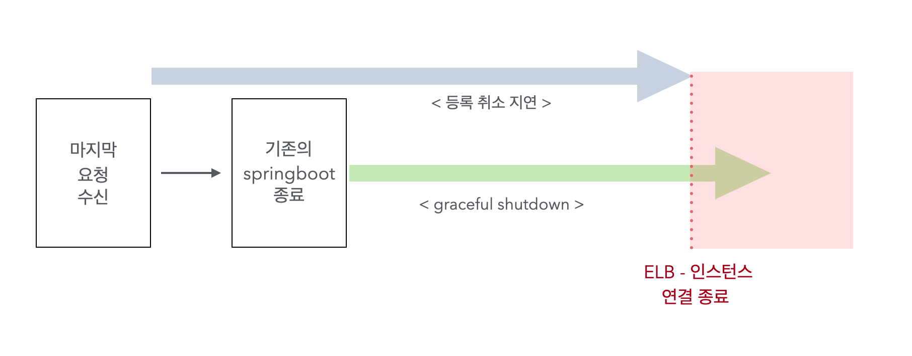

## 배경


기존 방법은, **의도적으로 헬스체크에 실패하도록 하는 API를 호출하여 ELB(로드 밸런서)의 트래픽 배분을 막는 방법**이었습니다. 팀원인 테니가 상황에 맞게 훌륭하게 구현해줬고, 문제될 여지가 거의 없다고는 느껴지지만 아래의 불확실성은 있다는 생각이 들었습니다.

1. 해당 API의 호출 시점, 그리고 서버의 상황에 따라 **실제 트래픽 중단까지 최대 10초에 가까운 시간 차이가 발생**합니다.
2. 배포 작업이 애플리케이션의 영향을 받습니다. 현재는 API를 호출하여 헬스체크에 사용되는 불리언 필드를 false로 바꿔 실패하도록 하고 있는데, 이걸 다시 true로 바꾸는 기능은 없습니다. 즉 배포 과정에서의 사소한 실수로 불필요하게 해당 API가 호출된다면 Springboot를 다시 배포해야 합니다.

> 기존 방법에 대한 자세한 내용은 [이전 글](https://pricelees.github.io/woowacourse/level4/improving_deployment/1/) 을 참고해주세요!
>

두개의 원인을 보면 결국 **API를 다른 무언가로 대체**하는 것이 해결 방법인 것 같은데요, 물론 다른 해결 방법도 있겠지만 이번 글에서는 AWS CLI에서 사용하는 **Deregister**라는 방법을 이용해 보겠습니다.


[AWS 공식 문서](https://docs.aws.amazon.com/ko_kr/elasticloadbalancing/latest/APIReference/API_DeregisterTargets.html)에서는 Deregister를 위와 같이 소개하고 있습니다. 이 글의 target에 EC2 인스턴스를 대입하면, “**대상 그룹에 등록된 인스턴스를 등록 취소하여 로드 밸런서가 보내는 트래픽을 받지 않도록 한다**” 라는 뜻이고, 이때 사용되는  Deregistration Delay는 이름 그대로 서버가 **in-flight 요청**(이미 들어와서 처리중인 요청)을 처리할 수 있도록 실제 등록 취소를 지연하는 시간(초 단위) 입니다.

> Deregistration Delay에 대한 개념은 [링크](https://karansingh.gitbook.io/aws-saa-c02/elb/connection-draining-deregistration-delay)를 참고해주세요!
>

따라서, 이번 글에서는 **aws-cli**를 이용한 Deregister와 Deregisteration Delay를 직접 적용해볼 예정이고, 글의 흐름은 다음과 같습니다.

1. Deregister 적용 및 확인
2. 확인 과정에서 판단한 문제
3. 이 문제의 원인 분석 및 해결 방법

그리고 이후의 내용에서는 **Deregister =** **등록 취소** / **Deregistration Delay =** **등록 취소 지연**으로 통일하여 사용할 예정입니다 😄

### 주의

1. 이 방법을 이용하기 위해서는 **ELB에 대한 IAM 권한 및 액세스 키가 필요**합니다. 현재 프로젝트에서는 우아한테크코스에서 제공하는 AWS를 사용하고 있고, 현재는 해당 권한이 없어 프로젝트에 적용할 수 있는 방법이 아닙니다.

> 리뷰를 할 때는 IAM 권한을 원하는 대로 수정할 수 없다는걸 감안하지 못했습니다.. 괜한 언급으로 시간을 뺏어 팀원 테니에게 죄송한 마음이 드네요 😭
>

2. 본 글에서는 해당 과정을 실제 적용해보는 과정을 위주로 다룹니다. 따라서 AWS-CLI를 우분투에 설치하고 IAM을 등록하는 등의 기본적인 과정은 생략합니다.

> AWS-CLI 설치는 [공식 문서](https://docs.aws.amazon.com/ko_kr/cli/latest/userguide/getting-started-install.html)를 확인해주시고,
> IAM 계정에는 ElasticLoadBalancingFullAccess 권한을 추가해주세요!
> 

<br/>

## 인스턴스 등록 취소하기

### 등록 취소 지연 시간 설정


등록 취소 지연값은 `EC2 → 대상 그룹 → 하단의 속성 탭 → 속성 편집`에서 설정할 수 있고, `기본값은 300초` 입니다.

### AWS-CLI에서의 등록 취소 및 재등록 명령

다음으로, aws-cli에서 인스턴스를 등록 취소하기 위해 아래 명령어를 입력합니다. 재등록 하는 경우는 deregister-targets만 `register-targets` 로 바꿔주시면 됩니다 !

```bash
aws elbv2 deregister-targets \
--target-group-arn [대상 그룹의 arn] \
--targets Id=[트래픽을 중단할 EC2의 인스턴스 ID]
```

여기서 대상 그룹의 arn은 사용하시는 대상 그룹 상세 페이지로 들어가면 ‘세부 정보’ 바로 아래 있는 arn으로 시작하는 값입니다.


> ARN은 AWS 리소스의 고유 식별자입니다. 리소스를 명료하게 지정하는 경우 사용합니다.
>

deregister 또는 register를 호출했을 때, aws 콘솔에 나오는 상태를 확인해 보겠습니다.


  | 
---|---|

1. deregister-targets를 호출 시, 왼쪽 사진처럼 드레이닝 상태가 되고, **지정한 등록 취소 지연 시간이 지난 뒤 대상에서 사라집니다**.
2. 그리고 등록 취소된 인스턴스를 register-targets로 재등록 요청시, 오른쪽 사진의 상태가 되고 **최초의 헬스체크 통과시 다시 트래픽이 전달**됩니다.

이제 위 과정을 이용하여, 실제 등록 취소 과정을 테스트 해보겠습니다.

<br/>

## 테스트

### 개요

  | 
---|---|

> 사진의 페이지는 실제 배포가 되어있는 페이지입니다.
왼쪽 사진의 페이지에서 입력한 시간(초) 만큼 **Thread.sleep()** 을 걸고, sleep이 끝나면 되면 오른쪽 사진의 페이지로 이동합니다.
>

테스트는 다음 순서로 진행합니다.

1. **등록 취소 지연 시간은 30초**로 지정합니다.
2. 이 페이지에서 **35초**를 지정한 뒤 요청을 보냅니다.
3. aws-cli에서 deregister-targets를 호출하여 등록 취소를 진행합니다.

1번과 2번 작업 사이에 1초 정도가 소요되니, 여유있게 35초로 잡은 요청은 등록 취소 지연 시간을 초과하기 때문에 500번대 응답(502)이 올 것이라 기대할 수 있겠습니다.

### 결과


위 사진처럼 19시 7분 `26초`에 deregister-targets을 호출했다면 30초 뒤인 `56초 이후`에 마무리되는 요청은 정상 응답이 나가지 않아야 하는데요, 실제 결과는 어떻게 되었을까요?


25초에 요청을 받고 00초에 마무리 된 35초 지연 작업이 정상 응답을 반환하는 예상과 다른 결과가 나타났습니다..

맨 위에서 작성한 공식 문서의 내용에 따르면 deregister-targets를 호출하여 인스턴스의 드레이닝이 진행되는 동안은 새로운 트래픽이 배분되지 않아야 하지만, 이 요청이 마무리가 되었다는 것은 deregister-targets 호출 이후에도 새로운 트래픽이 배분된 것이라고 생각할 수 있겠습니다.

### 원인 파악하기

이전에 예상했던 대로, deregister-targets 호출 이후에도 ELB가 트래픽을 배분하는지 확인해 보겠습니다. 로그를 조금 더 편하게 찍기 위해 위의 페이지와 동일한 기능을 하면서 요청 시간 / 완료 시간을 JSON으로 응답하는 API를 하나 추가하였습니다.

```java
@Test
public void test() throws InterruptedException {
	log.info("start test");

	for (int i = 1; i <= 30; i++) {
		Thread.sleep(1000);
		sendRequest();
	}

	Thread.sleep(31 * 1000);
}

void sendRequest() {
	WebClient webClient = WebClient.builder().baseUrl("배포중인 도메인").build();
	LocalDateTime requestTime = LocalDateTime.now();

	webClient.post()
		.uri("/shutdown-test-v2")
		.bodyValue(new ShutdownRequest(requestTime, 10))
		.retrieve()
		.bodyToMono(ShutdownResponse.class)
		.subscribe(
			result -> log.info("request result: {}", result),
			error -> log.error("requestTime: {}, result: {}", requestTime.format(DATE_TIME_FORMATTER),
				error.getMessage())
		);
}
```

> 비동기 요청을 위해 WebClient를 사용하였습니다. WebClient 사용을 위해선 Spring Webflux 의존성 추가가 필요합니다 !
>

테스트는 위 코드를 이용하여, 1초 단위로 요청을 계속 보내면서 deregister-targets 호출 이후 실제 요청이 들어가는지 확인해 보겠습니다. 테스트를 위해 **등록 취소 지연 시간은** 기존의 30초보다 짧은 **10초**로 지정하고, Thread.sleep()을 거는 **딜레이도 동일한 10초**로 지정하였습니다.


위 사진은 실제 테스트 과정에서의 로그이고, 이 로그들을 조금 더 자세히 확인해 보겠습니다.

1. **502 응답**

우선 502 응답 부터 살펴보자면, 테스트에서 사용하는 API는 **순수 Thread.sleep() 시간만 등록 취소 지연 시간과 동일한 10초**이기에 실제 실행 시간은 10초를 초과합니다.


따라서 nginx 로그를 살펴보면 이 요청에 대해서는 서버가 `499` 응답을 보낸 것으로 확인되고,

> 499: 서버가 요청을 처리하고 **응답을 보내기 전에 클라이언트가 서버에 대한 연결을 종료할 때 Nginx가 보내는** 상태 코드. (출처: [http-statuscode.com](https://http-statuscode.com/ko/code/4XX/499-unofficial))
>

이는 서버가 응답을 보내기 전에 등록 취소 지연 시간이 지나 ELB와 서버간의 연결이 끊어졌기 때문이라고 할 수 있겠습니다. 실제로 등록 취소 지연을 기존과 동일한 10초로 했을 때, 테스트에 사용하는 딜레이만 9초로 낮춰도 502 응답은 나가지 않습니다 ㅎㅎ

2. **503 응답**

deregister-targets를 호출한 56분 58초부터 약 **14초** 뒤인 57분 12초부터의 요청은 모두 503 응답이 나갔는데요, 이때부터는 nginx 로그를 확인해도 해당 요청은 없는 바 이 시점부터 ELB의 트래픽 배분이 중지되었다고 판단할 수 있습니다.

그러면 이 14초는 어떻게 산정된 값일까요?


우선 위에 있는 헬스체크 로그를 보면 deregister-targets 호출 이후 3초, 8초 뒤에 헬스체크 요청이 왔는데, 이때의 응답은 모두 200이니 헬스체크는 연관이 없는 것 같습니다. 그래서 ‘**deregister-targets 호출 이후에는 트래픽을 보내지 않는다고 하는데, 실제로 보내고 있다**’ 라는 원론으로 돌아가서 생각해보니, 가장 유력하게 느껴지는 원인은 **요청 이후 실제 ELB에 반영되는 시간**인 것 같았습니다.

```bash
aws elbv2 modify-target-group \
--target-group-arn [대상 그룹의 arn] \
--health-check-interval-seconds [헬스체크 간격 시간(초)]
```

위의 코드는 AWS-CLI에서 헬스체크 간격을 수정하는 코드입니다. 이 코드를 호출해서 헬스체크 간격을 기존의 값인 5초에서 10초로 수정한 뒤 실제로 반영이 되는 시간을 확인 해 보겠습니다.


헬스체크 간격 수정 명령어는 22분 16초에 호출했고, 위의 로그를 보면 31초까지는 5초 단위로 헬스체크 요청이 오고 이후부터 10초로 변경된 것을 확인할 수 있습니다. 초 단위까지만 측정하여 정확하지는 않지만 실제 변경까지는 대략 14~15초 정도 소요되고, 이 시간은 이전에 deregister-targets 호출 뒤 트래픽 중단까지 걸린 14초와 대략적으로 비슷한 시간임을 확인하였습니다.

### 결론

aws-cli에서 제공하는 deregister 기능은 정상 작동하긴 하지만, 기대와 달리 실제 트래픽 중단까지는 약 14초가 소요되고, 헬스체크 간격 변경이 실제 반영될 때 까지 15초 정도가 소요되는 것을 보아 CLI에서의 요청 뒤 실제 ELB로의 반영까지는 대략 15초 전후의 시간이 걸린다고 예측할 수 있습니다.

이제 마지막으로, 이걸 실제 배포 과정에 적용하는 과정과 CLI 요청 후 실제 ELB까지의 반영에 걸리는 시간 문제를 해결한 방법을 소개하겠습니다.

<br/>

## 실제 배포에 적용하기

### 개요

기존의 과정은 **헬스체크 실패 API 호출 → 25초 sleep → 기존 스프링부트 종료 → 새로운 스프링부트 배포** 순서로 진행됩니다. 스크립트 코드를 대략적으로 작성하면 다음과 같습니다.

```bash
curl -X POST http://localhost:8080/termination
sleep 25

kill [기존 springboot]

.. 
clone 및 gradle 빌드 등
..

nohup java -jar [새로운 springboot]
curl -X GET http://localhost:8080/health 반복 호출로 새로운 springboot가 정상적으로 실행되었는지 확인
```

수정할 과정은 deregister-targets 호출 → **[실제 ELB까지 반영되어 트래픽이 전송되지 않을 때 까지 대기]** → 기존 스프링부트 종료 → 새로운 스프링부트 배포 → register-targets 호출 순서로 진행됩니다.

```bash
aws elbv2 deregister-targets ..
[실제 트래픽 중단까지 대기]

kill [기존 springboot]

.. 
clone 및 gradle 빌드 등
..

nohup java -jar [새로운 springboot]
curl -X GET http://localhost:8080/health 반복 호출로 새로운 springboot가 정상적으로 실행되었는지 확인

aws elbv2 register-targets ..
```

그러면 새로운 과정에서 고려해볼 것은, 실제 트래픽 중단까지 대기하는 시간과 등록 취소 지연 시간이 되겠네요. 우선 등록 취소 지연 시간부터 살펴보겠습니다.

### Graceful shutdown과 등록 취소 지연 설정

현재 Springboot의 graceful shutdown timeout은 기본값인 30초로 지정되어 있습니다.

> graceful shutdown: 지정한 timeout까지의 요청은 처리하고 애플리케이션을 종료하는 방법
>

이전의 테스트 결과(502 응답이 나온 상황)로부터, 인스턴스가 마지막 요청을 받은 뒤 지정한 등록 취소 지연 시간이 지나면 애플리케이션이 요청을 처리해도 실제 응답까지 가지 않는다는 것을 확인하였습니다.

즉, Graceful shutdown이 진행되는 동안 등록 취소 지연 시간이 지나면 이 응답은 사용자에게 가지 않을 것입니다.



> 위 그림에서의 화살표 길이는 등록 취소 지연 시간 및 graceful shutdown timeout 시간이라고 생각해주세요!
>

그림으로 살펴보면 대략 이런 느낌인데요, 만약 Graceful shutdown timeout이 등록 취소 지연 시간보다 길어진다면 실제 Springboot는 요청을 처리했지만 이 응답이 사용자에게 가지는 않습니다.


따라서 Springboot의 종료는 위 그림처럼 등록 취소 지연 시간이 지나기 전에 마무리가 되어야 하며, 마지막 요청 수신과 기존의 springboot의 종료가 순서대로 진행되니 **graceful shutdown timeout은 등록 취소 지연 시간보다 작거나 같게 설정**해야 합니다.

### 실제 트래픽 중단까지 대기 - 시간 지정

이제 이전의 개요에 있던 **실제 트래픽 중단까지 대기**만 잘 하면 되겠네요. 제가 사용할 방법은, **실제 데이터를 측정한 뒤 나온 통계량을 이용해서 적절한 대기 시간을 거는 방법**입니다.

> 사실 이 방법은 본문을 작성하며 진행한 수십 번의 테스트에서 시작되었습니다ㅎㅎ 매번 확인하다 보니 자연스레 ‘15초를 초과하지 않을 것이다’ 라는 가설 검증의 과정으로 진행 되더라구요
>

우선 통계량을 구하기 위해 테스트를 진행하겠습니다. 테스트는 deregister-targets 명령어 호출 이후 0.1초 단위로 요청을 보내고 503 응답이 나올 때 까지의 시간을 기록하는 순서로 진행하며, 총 30회 수행합니다. 아래 그래프는 이 작업을 총 30회 시도했을 때의 분포입니다.

> 30회는 보통 정규분포를 가정할 때 사용하는 최소 표본 수입니다.
>


대부분의 결과가 13초 이내이고 최대값은 13.46초로 아무리 늦어도 13.5초 내에는 트래픽이 중단됩니다. 30번의 시도를 한 이유는 정규분포를 가정하고 확률을 계산하기 위함이지만 실제 위 분포를 정규분포로 가정하기에는 근거가 부족한 것 같아요.


그래서 [Shapiro-Wilk 정규성 검증](https://en.wikipedia.org/wiki/Shapiro%E2%80%93Wilk_test)으로 실제 정규성을 가지는지 검증했고, 검증 결과로 나온 P-value는 0.068로 정규성을 가진다고 할 수 있는 기준값인 0.05를 초과합니다. 
따라서 이 분포를 정규분포로 가정한 뒤 확률을 계산해보면 트래픽 중단까지의 시간이 **14초를 초과할 확률은 0.16%**, **15초를 초과할 확률은 0.000021%** 로 계산되고, 저는 deregister-targets 호출 이후 `sleep 15`로 15초를 기다리는 방식으로 진행하였습니다.

> AWS가 제공하는 서비스의 안정성을 생각하면 이상치가 나올 가능성이 극히 적다는 생각도 있었습니다 ㅎㅎ
>

<br/>

## 마무리

글이 꽤나 길어졌네요..ㅎㅎ 그래서 일단 간단하게 요약해 보겠습니다.

1. 팀원이 구현한 API를 호출하여 헬스체크에 실패하도록 하는 방법은 좋은 방법이고, 현재는 IAM 권한 문제로 이 방법이 최선입니다.
2. 하지만 API를 사용하는데에서 오는, 배포와 애플리케이션의 의존에서의 불확실성이 존재하긴 합니다.
3. AWS-CLI의 deregister-targets을 이용하여 ELB가 트래픽을 중단하도록 할 수 있습니다. 이 경우 등록 취소 지연(deregistration delay)를 springboot의 graceful-shutdown tiimeout보다 같거나 크게 설정해야 합니다.
4. deregister-targets를 호출해도 실제 ELB에 반영되어 트래픽이 중지될 때 까지는 약 15초정도가 소요되며, 30회 측정 후 통계량을 구한 결과를 바탕으로 계산했을 때 15초를 초과할 확률은 매우 낮습니다. 따라서 deregister-targets 명령어 호출 이후 15초를 대기합니다.

이전 글도 그렇고, 이번 글도 그렇고 코드 리뷰를 하며 남긴 “Deregistration delay를 도입할 수 있지 않을까?” 라는 댓글에서 시작했습니다. 저도 이런 개념이 있다 정도만 얼핏 봤지 실제로 적용해본 방법은 아니었는데요, 처음부터 하나씩 알아가다보니 많은 시간이 쓰이긴 했지만 그만큼 의미있고 보람찬 작업이었던 것 같습니다 ㅎㅎ

복잡하고 긴 내용이지만 여기까지 읽어주셔서 감사합니다 😄
