## 배경

> 이번 글에서 다루는 deregister-targets 등의 개념은 [1편](https://pricelees.github.io/woowacourse/level4/improving_deployment/2/)에 작성되어 있습니다..ㅎㅎ 1편을 먼저 읽고 이번 글을 읽어주시면 감사하겠습니다.
>

지난 글에서 통계량을 이용해 deregister-targets 호출 이후 실제 트래픽 중단까지 소요되는 최대 시간을 15초로 잡았었습니다. 지난번에 계산했던 트래픽 중단까지의 시간이 **15초를 초과할 확률은 0.000021%** 로 극히 미미한 수준이지만, 그럼에도 발생 가능성이 있다는 찝찝함은 있었던 것 같습니다.

그래서.. [aws-cli의 elbv2 API 문서](https://docs.aws.amazon.com/cli/latest/reference/elbv2/)를 하나씩 살펴보던 도중 wait이라는 키워드를 발견했는데요, 이번 글에서는 wait을 이용하여 기존의 불확실성을 더 개선하는 방법을 소개하겠습니다.

### wait API

> Wait until a particular condition is satisfied. Each subcommand polls an API until the listed requirement is met.
>

[공식 문서](https://docs.aws.amazon.com/cli/latest/reference/elbv2/wait/)의 Description에 따르면,  wait 키워드는 특정 조건이 충족될 때 까지 기다리는 명령어입니다. 위의 Each subcommand의 종류는 다음과 같습니다.

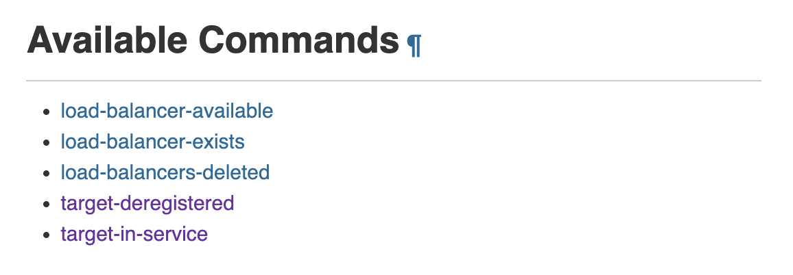

커맨드 목록을 보니, **target-deregistered**와 **target-in-service**에서 뭔가 원하는 해답을 찾을 수 있을 것 같은데요, 테스트를 진행하며 이 두가지를 더 자세하게 살펴보겠습니다.

<br/>

## target-deregistered

### 개념

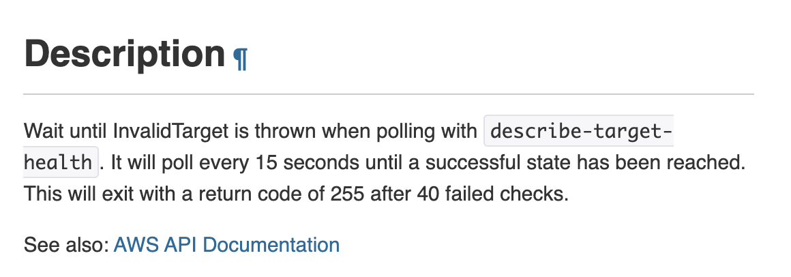

[공식 문서](https://docs.aws.amazon.com/cli/latest/reference/elbv2/wait/target-deregistered.html)의 내용에 따르면, `InvalidTarget`이라는 상태가 호출될 때 까지 **15초 단위로 총 40번 시도**하는 것 같습니다. 그러면 일단 InvalidTarget이 실제 deregister-targets와 연관이 있는지 확인해볼 필요가 있겠고, describe-target-health를 먼저 호출해 보겠습니다. 명령어는 다음과 같습니다.

> 15초 단위로 시도한다는 것을 봤을 때 이전 글에서의 15초와 연관이 있는 것 같다는 생각이 들어 살짝 소름돋았어요 ㅎㅎ
>

```bash
aws elbv2 describe-target-health \
--target-group-arn [대상 그룹의 arn] \
--targets Id=[인스턴스 id] # targets 옵션은 선택입니다. 입력하지 않아도 됩니다!
```

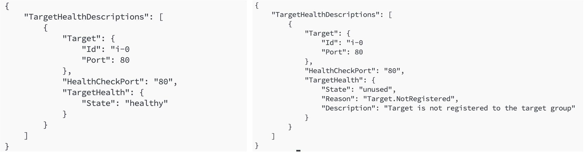

왼쪽의 결과는 ELB가 트래픽을 보내고 있고, 인스턴스가 등록되어 있는 상태이고 오른쪽은 deregister-targets 호출 이후 실제 등록 취소가 완료된 상태에서의 결과입니다. 설명에 있는 InvalidTarget이라는 키워드는 없긴 한데, 추측하자면 TargetHealth.State로 판단하는 것 같습니다 ㅎㅎ

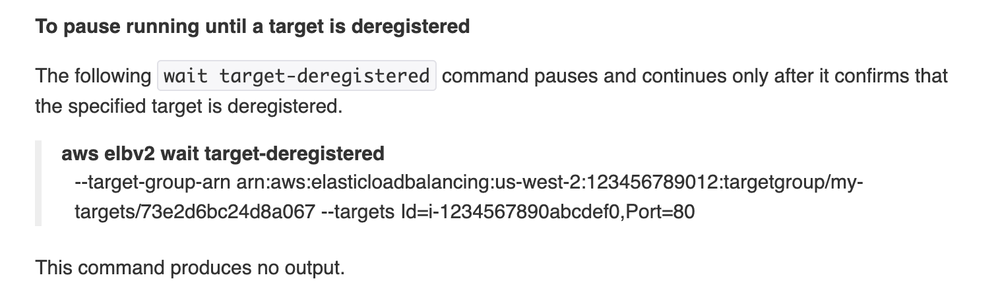

사용 예시를 보면, 특정 타겟(인스턴스)를 지정하면 그 대상이 등록 취소될 때까지 멈추는 것 같네요. 이제 이 내용을 바탕으로 실제 테스트를 진행해 보겠습니다.

### 테스트

```bash
aws elbv2 deregister-targets .. 

START=$SECONDS
aws elbv2 wait target-deregistered \
--target-group-arn [대상 그룹의 arn] \
--targets Id=[인스턴스 id]
END=$SECONDS

echo "소요 시간: $(($END - $START))"
```

바로 이전에 있는 사용 예시를 보면 `The following wait target deregistered command pauses and continues only after..`  라는 내용이 있는데요, 위 스크립트를 실행하여 deregister-targets를 먼저 호출한 뒤 wait target-deregistered의 실행이 완료되는 시간을 측정해 보겠습니다.


결과를 보면 **16초**가 걸렸는데요, 어라라..? 이전 글에서 15초 내로는 무조건 트래픽 중단(=등록 취소)이 된다고 한 것과는 다른 결과가 나왔습니다. 그래서 한번 더 테스트를 진행해볼건데, 이번에는 1초 단위로 실제 요청을 보내면서 실제 503 응답까지의 소요 시간도 측정해볼게요.

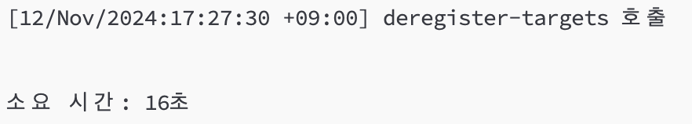

deregister-targets는 **27분 30초**에 호출되었고, 이번에도 똑같이 `wait target-deregistered` 가 완료되는 시간은 **16초**가 걸렸는데요,

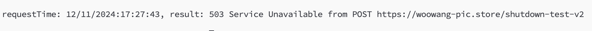

1초 단위로 요청을 보내면서 503 응답이 온 최초의 시점을 보면 **27분 43초**로 실제 트래픽 중단은 deregister-targets 호출 후 **13초**가 지난 시점에서 이뤄진 것을 확인할 수 있었습니다. 이 결과로 생각해보면, wait 명령어도 약간의 딜레이는 있다고 생각할 수 있을 것 같습니다.

그러면 이번에는 실제로 딜레이가 있는건지 확인해볼게요.

```bash
aws elbv2 deregister-targets .. 
sleep 15

# 이후 내용은 동일합니다. 
```

이전에 sleep 15가 끝나는 시점에서는 ELB의 트래픽 중단, 즉 등록 취소가 완료될 것이라고 예상했는데요, 그러면 sleep 15 이후에 호출되는 wait target-deregistered는 빠른 시간 내에 완료가 되어야 하겠네요!


sleep 15를 포함한 위 스크립트를 돌려보면, **소요 시간이 1초**로 사실상 wait의 호출과 동시에 완료되었다고 할 수 있겠네요.

### 결론

`wait target-deregistered` 명령어를 호출하면, 실제로 인스턴스가 등록 취소(deregister)될때까지 기다린 후 그 이후의 명령어를 실행합니다. 실제 트래픽이 중단되는 시간보다는 약간의 딜레이가 있긴 하지만, wait 명령어가 완료되는 시점에서는 트래픽이 반드시 중단된다고 할 수 있습니다. 즉, 이전의 0.000021%로 추측한 약간의 가능성도 완전히 차단할 수 있겠습니다.

<br/>

## target-in-service

### 개념

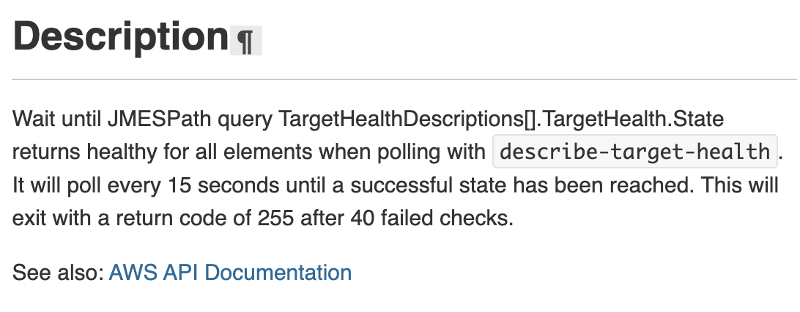

[공식 문서](https://docs.aws.amazon.com/cli/latest/reference/elbv2/wait/target-deregistered.html)의 내용에 따르면, target-in-service는 타겟(인스턴스)의 상태가 ‘`healthy`’가 나올 때 까지 15초 단위로 총 40번 요청을 보내면서 대기하는 명령어입니다.


이전에 target-deregistered에서 확인했던 describe-target-health 결과를 다시 확인해보면, 이 JSON 응답에 있는 `TargetHealth.State` 를 확인하는 것 같습니다.

> 그리고 등록 취소된 인스턴스를 register-targets로 재등록 요청시, 오른쪽 사진의 상태가 되고 **최초의 헬스체크 통과시 다시 트래픽이 전달**됩니다.
>

위의 내용은 이전 글에 작성한 내용인데요, `wait target-in-service` 명령어를 이용하면 실제 register-targets 호출 후 트래픽 전달까지의 소요 시간도 측정할 수 있겠네요 ㅎㅎ

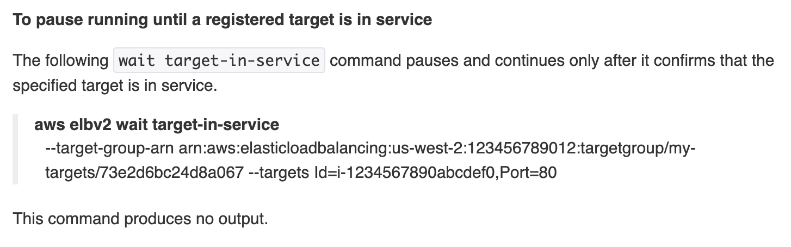

사용 예시는 이전의 target-deregistered와 동일하고, 바로 테스트를 진행하겠습니다.

```bash
aws elbv2 deregister-targets..
sleep 15

aws elbv2 register-targets ..

START=$SECONDS
aws elbv2 wait target-in-service \
--target-group-arn [대상 그룹의 arn] \
--targets Id=[인스턴스 id]
END=$SECONDS

echo "소요 시간: $(($END - $START))"
```

이 스크립트는 우선 deregister-targets와 sleep 15로 인스턴스를 등록 취소하고, `register-targets`를 호출한 뒤 `wait target-in-service` 가 완료되는 시간을 측정하는 스크립트입니다.


이번에도 지난번과 동일하게 16초가 소요되었네요. 16초라는 시간은 추측해보면 **최초 확인 → 15초후 재확인 → 통과**의 흐름에서의 소요 시간인 것 같아요. 이번에도 지난번과 동일하게 실제로 요청을 보내면서 실제로 응답이 오는 최초 시간을 측정해 보겠습니다. 이번에는 describe-target-health도 1초마다 호출하여 실제 상태가 어떻게 나오는지도 같이 관찰해볼게요.


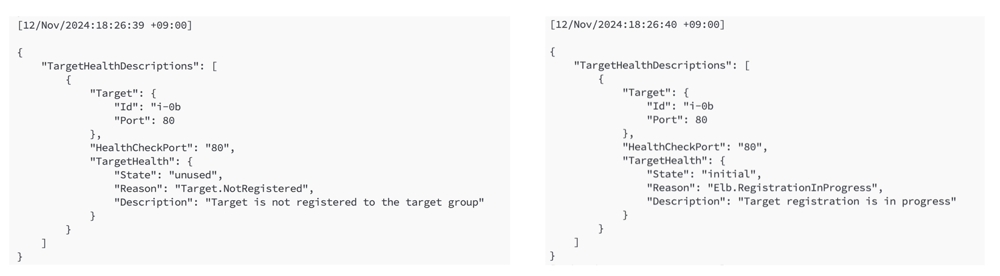

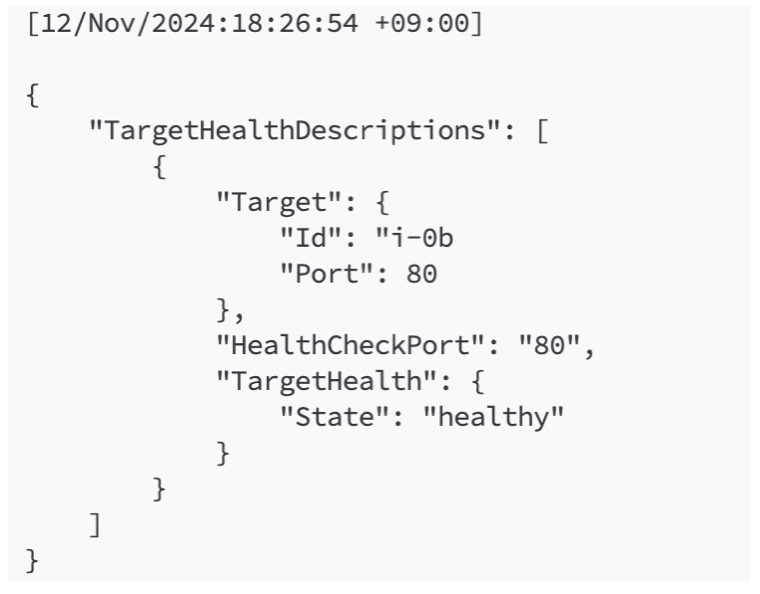

**register-targets는 26분 40초에 호출**했고, 이전까지는 왼쪽의 사진처럼 unused 상태였다가 바로 initial 상태로 변경되었고, 이후 register-targets 호출 후 **약 14초가 지난 시점인 26분 54초부터 상태가 ‘healthy’로 변경**되었습니다.

그러면 실제 트래픽은 언제부터 보내졌을까요?

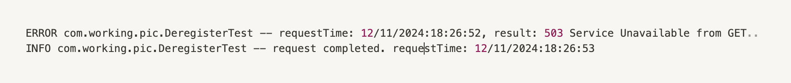

위의 로그를 확인해보면, 52초까지의 요청은 503 응답이 나가다가 53초의 요청부터는 정상 응답이 반환되었습니다.

### 결론

`wait target-in-service` 명령어를 호출하면 **인스턴스가 healthy 상태가 될 때 까지** 기다린 뒤 그 이후의 명령어를 실행하고, 실제 트래픽이 배분되기 시작하는 시간보다는 약간의 딜레이가 있음을 확인하였습니다. 즉 이전의 target-deregistered와 동일한 결과이며, wait target-in-service가 완료되는 시점부터는 인스턴스가 ELB의 트래픽을 정상 수신할 수 있습니다.

<br/>

## 배포 스크립트 최종 수정

이전 글에서는 등록 취소를 위주로 다뤘습니다. 배포 과정이 완료되고 register-targets을 호출한 뒤에는 sleep을 걸지 않았던 이유는 두 번째 인스턴스의 배포가 시작되고, 이 인스턴스의 등록 취소가 진행되는 사이에 배포가 완료된 인스턴스가 트래픽을 받는다는 생각이었습니다.

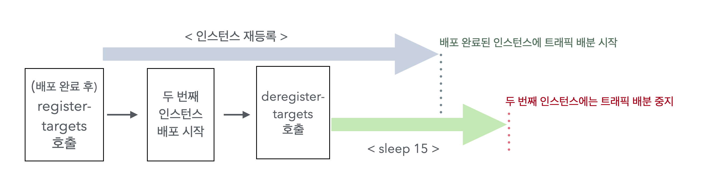

그림을 보면, 초록색 점선 시점부터는 배포가 완료된 인스턴스가 트래픽을 수신할 수 있으니 첫 번째 배포가 마무리 된 이후에는 sleep을 진행하기 보다는 빠르게 두 번째 인스턴스의 배포를 시작하는게 좋다는 생각이었습니다.

하지만 이 방법도 ELB의 트래픽 배분까지의 소요 시간이 15초를 초과할 0.000021%의 확률처럼 불확실성을 완전히 해소하는 방법은 아니라고 생각해요. 따라서 지금까지의 내용을 바탕으로 배포 과정을 다시 정리해 보겠습니다.

```bash
aws elbv2 deregister-targets ..
sleep 15

kill [기존 springboot]

.. 
clone 및 gradle 빌드 등
..

nohup java -jar [새로운 springboot]
curl -X GET http://localhost:8080/health 반복 호출로 새로운 springboot가 정상적으로 실행되었는지 확인

aws elbv2 register-targets ..
```

위에 있는 스크립트가 이전 편에서의 결과였고, 전체적으로 비슷하지만 다음 내용을 수정하겠습니다.

1. `sleep 15` → `aws elbv2 wait target-deregistered` 로 수정
2. `curl을 이용한 헬스체크`를  `aws elbv2 wait target-in-service..` 로 대체

즉 스크립트가 다음의 형태로 바뀌게 되고,

```bash
aws elbv2 deregister-targets ..
aws elbv2 wait target-deregistered ...

kill [기존 springboot]

.. 
clone 및 gradle 빌드 등
..

nohup java -jar [새로운 springboot]

aws elbv2 register-targets ..
aws elbv2 wait target-in-service..
```

바뀐 형태에서는 아래 내용을 확신할 수 있겠습니다.

1. `kill [기존 springboot]`를 호출하는 시점에서는 **더 이상 ELB가 트래픽을 보내지 않는다**.
2. 두 번째 인스턴스의 배포를 시작할 때, **배포가 완료된 첫 번째 인스턴스는 ELB가 보내는 트래픽을 정상 수신하는 것이 보장**된다.

마지막의 wait에는 **적절한 타임아웃을 걸어 특정 시간 내에 완료되지 않으면 배포를 중단**(exit 1)하는 코드를 추가할 수 있을 것 같습니다 ㅎㅎ 이건 각자의 운영 환경에 맞게 정하면 될 것 같아요.

<br/>

## 마무리

길고 길었던(~~그리고 커피 한 잔 만큼의 서버비용이 나간..~~) 정리가 드디어 끝났습니다👏👏 다시한번 말씀드리자면 Deregister 과정은 IAM 권한이 필요한 작업이고, 우아한테크코스에서 제공하는 AWS를 사용하고 있는 현재 프로젝트에서 적용할 수 있는 방법은 아닙니다.

그럼에도 이번 과정을 진행하며 기존에 했던 배포의 전 과정을 다시 돌아볼 수 있었고, IAM 권한이 있는 AWS 계정을 사용한다면 배포 과정을 조금 더 효율적으로 구성할 수 있다는 점에서 정말 보람찬 과정이었다고 생각합니다 ㅎㅎ

읽어주셔서 감사합니다 😄