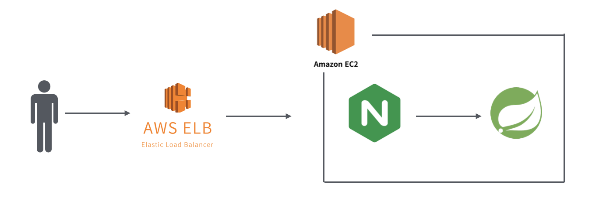
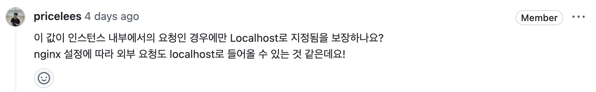
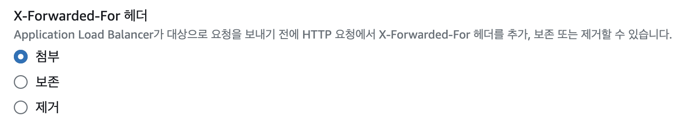
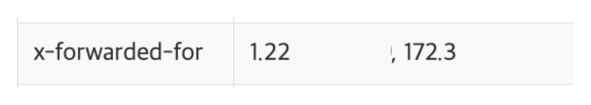
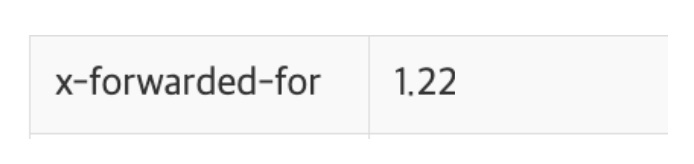

## 배경

팀원의 코드를 리뷰하고 있었는데, 아래와 같은 코드가 있었습니다.

> 실제 코드와 다르며 내용 파악을 위해 일부 수정하였습니다.
> 
> 내용은 중요하지 않긴 하지만.. 간단하게만 말씀드리면 ELB에서의 헬스체크를 의도적으로 실패하도록 하는 API 입니다.
>

```java
@PostMapping("/terminate")
public ResponseEntity<Void> terminate(HttpServletRequest request) {
    String remoteHost = request.getRemoteHost();
    if ("127.0.0.1".equals(remoteHost) || "0:0:0:0:0:0:0:1".equals(remoteHost) || "localhost".equals(remoteHost)) {
        isTerminated.set(true);
        return ResponseEntity.ok().build();
    }
    return ResponseEntity.status(HttpStatus.FORBIDDEN).build();
}
```
<br/>

이 코드에서의 핵심은 **클라이언트의 IP(=remoteHost)가 로컬호스트인 경우에만 OK 응답**을 주겠다는 건데, 여기서 의문이 들었던 것은 “**Nginx 설정과 무관하게 getRemoteHost()가 항상 실제 클라이언트의 IP를 반환할 것을 보장하는지?**” 였는데요, 의문이 들었던 내용부터 실제 테스트를 하며 확인한 결과를 하나하나 작성해 보겠습니다.

<br/>



시작하기 전에, 이번 글에서 사용하는 인프라 구조입니다!

<br/>

## 질문

이전 문단에 나왔던 코드의 getRemoteHost() 부분에 아래와 같은 질문을 남겼었습니다.



찝찝했던 이유는 이전에 ELB를 사용하기 전 EC2로 직접 요청을 보냈을 때 클라이언트 정보를 읽어오지 못해 문제가 발생했던 경험이 있었기 때문인데요, 이번에 ELB를 도입하며 비슷한 문제가 발생할 수도 있겠다는 우려가 있었던 것 같습니다 ㅎㅎ

> 당시 발생했던 문제는 getRemotePort()를 호출했을 때 실제 요청 포트(443)을 읽지 못해 Swagger-UI에서 CORS가 발생했던 것인데요, [PR 링크](https://github.com/woowacourse-teams/2024-mouda/pull/506)에서 확인하실 수 있습니다.
>

<br/>

시작하기 전에, 우선 `getRemoteHost()`에 어떤 값이 들어가는지부터 확인해야 할 것 같습니다. 아래 코드는 HttpServletRequets의 구현 클래스 중 하나인 Request 클래스의 메서드입니다.

```java
public class Request implements HttpServletRequest {
        ..
        public String getRemoteHost() {
            if (this.remoteHost == null) {
                if (!this.connector.getEnableLookups()) {
                    this.remoteHost = this.getRemoteAddr();
                } else {
                    ...
                }
            }
    
            return this.remoteHost;
        }
        ..
}
```

코드를 보면, getRemoteHost()도 `getRemoteAddr()` (=클라이언트의 IP)를 값으로 가지는데요, 이 메서드를 호출했을 때 실제 클라이언트의 IP를 기록하려면 아래의 설정이 필요합니다.

<br/>

- **필수**:  Nginx 설정파일에 `proxy_set_header X-Forwarded-For $proxy_add_x_forwarded_for;` 를 추가하여 X-Forwarded-For 헤더를 springboot에 전달하도록 해야 합니다d.
1. application.yml에 `server.forward-headers-strategy=native` 과 같은 Forward 헤더를 읽는 설정을 추가한다.
2. 설정을 추가하지 않았다면, getRemoteHost()가 아니라 `getHeader(”X-Forwarded-For”).split(”, “)[0]` 으로 값을 읽어와야 한다.

위 과정 또는 비슷한 과정을 거치지 않았다면 인스턴스 외부에서의 요청에도 getRemoteHost()를 호출했을 때의 결과가 Localhost가 될 수 있습니다. 사실 ELB가 추가된 환경에서도 클라이언트의 IP를 정확하게 읽어올 것이라고 예상되긴 하는데요, 그럼에도 잘못 호출되는 경우 서버가 터질 우려가 있기에.. 적어도 한 번은 확인해볼 필요가 있다고 생각했습니다.

> 제 테코톡([링크](https://youtu.be/oUroldyG1_s?si=osh0ER_t6s8JWUNG&t=642))에서 X-Forwarded-For 헤더와 클라이언트의 IP를 기록하는 방법을 다룹니다 ㅎㅎ 아래 글이 이해가 안 가신다면 영상을 참고해주세요!
>

<br/>

## 확인

이전 문단에서 다뤘듯이, 클라이언트의 IP를 가져오려면 **springboot로 가는 요청에 클라이언트의 IP가 담긴 X-Forwarded-For 헤더가 포함**되어야 하는데요,



`AWS ELB 상세 페이지 → 작업 → Load Balancer 속성 편집`에 있는 위 설정으로 X-Forwarded-For 헤더 설정이 가능하며, 각 항목은 다음과 같습니다.

- **첨부**: X-Forwarded-For 헤더에 클라이언트의 IP를 저장(추가) 하여 서버로 전달
- **보존**: 기존의 X-Forwarded-For를 그대로 전달
- **제거**: 기존의 X-Forwarded-For가 있으면 삭제

따라서 클라이언트의 요청을 받는 ELB에서는 해당 설정이 ‘`첨부`’로 되어 있어야 실제 클라이언트의 IP가 기록되어 전달됩니다.

```java
Map<String, String> headers = new HashMap<>();
request.getHeaderNames()
	.asIterator()
	.forEachRemaining(headerName -> headers.put(headerName, request.getHeader(headerName)));
```
<br/>

확인은 위 코드를 이용하여 실제 요청에 있는 모든 헤더를 출력한 뒤 EC2 내부의 Nginx 설정에 따라 X-Forwarded-For 헤더가 어떻게 달라지는지, 실제 헤더가 포함되고, 클라이언트의 IP가 잘 전달되는지 확인하는게 목표입니다!

<br/>

### 1. Nginx 설정에 X-Forwarded-For 헤더 설정이 있는 경우

```nginx
location / {
        proxy_pass http://localhost:8080;
        proxy_set_header X-Forwarded-For $proxy_add_x_forwarded_for;
}
```

Nginx 포워딩 설정에 proxy_set_header를 추가하고, springboot로 요청을 보낸 뒤 헤더를 출력하면 아래와 같이 x-forwarded-for 헤더에 실제 클라이언트의 IP(1.22~)와 ELB의 IP(172.3~)가 포함됩니다.



<br/>

### 2. Nginx 설정에 X-Forwarded-For 헤더 설정이 없는 경우

1번에서의 proxy_set_header 라인을 지우고 동일하게 테스트를 해보면, 예상대로 아래와 같이 ELB의 IP는 기록되지 않고 클라이언트의 IP 만 기록됩니다.



<br/>

### 결론

- ELB에서의 X-Forwarded-Header 설정을 `첨부`
- springboot에 `server.forward-headers-strategy=native` 설정

위와 같은 현재 프로젝트의 환경에서는, EC2의 Nginx에 `proxy_set_header X-Forwarded-For "127.0.0.1";` 와 같이 localhost를 명시적으로 지정하지 않는 한, 인스턴스 외부 요청에 대한 getRemoteHost() 값이 localhost가 될 수 없음을 확인하였습니다.

<br/>

## 의의

AWS와 같은 배포 및 인프라 작업은, 어느정도 결과가 예상되도 확실하게 테스트를 하는게 속이 편한 것 같습니다. 글에서 다룬 내용은 진작에 알던 내용이지만 확실하게 하지 않으면 엄청나게 큰 문제가 발생할 수 있는 것을 사전에 확인해보는,  ‘절벽에 있는 돌다리를 두들겨보고 건너는’ 작업이었다는 점에서 의미가 있었던 것 같습니다 ㅎㅎ

```toc
```